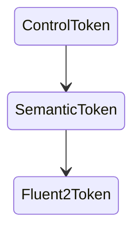
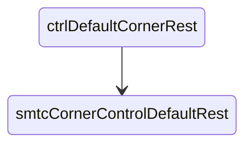
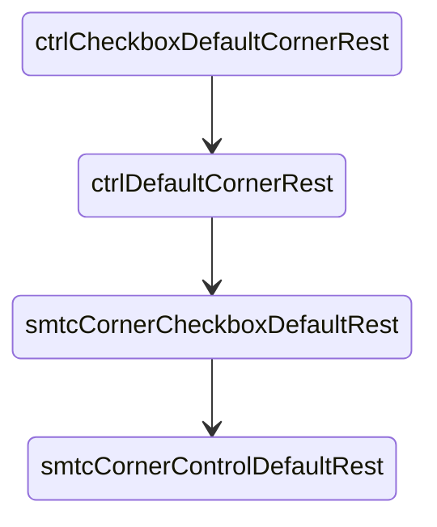

# Design Token Semantic

The data in the file `design-token.semantics.json` is exported from a Figma Plugin<!-- TODO: link to figma plugin -->. This is intended to be a snapshot of the semantic design system mapping at any given time. This is not intended to be updated except manually by developers to allow for migration planning, low complexity, and manual mapping to any legacy system.

Using semantic tokens allows us to migrate design systems, allow for cross-platform styling, and better documentation.

## Goals

### Simplify

Design tokens exist as a mapping in JSON that describes the relationship between the token and the value it points to. This simple approach makes it easy to understand at a glance, and to create tooling for the semantic token mapping.

### Cross Platform

By defining specific granular tokens which fall back to the semantic design token system, this creates the ability to override any specific value per component. This will enable developers to fine tune any edge cases they may come across when implementing the design system on their platform.

The fallback starting from a granular control token, to a more broad semantic token, to the fluent 2 token:



CSS:

```css
var(--ctrlToken, var(--smtcToken, var(--fluent2Token)));
```

### Migration

Design systems are always in a state of change, either new considerations must be made as new components are added, or entire new design systems are created which creates a challenge to update platforms without causing breaking visual changes.

An example scenario, a design system update has occured and now the mapping of the semantic token `--smtcCornerControlDefaultRest` which is mapped to `--ctrlDefaultCornerRest` was the same for `button`, `badge`, and `checkbox`, but now `checkbox` requires a different value.

Previous mapping:



CSS:

```css
/* CSS variable fallbacks used for 'button', 'badge', and 'checkbox' */
var(--ctrlDefaultCornerRest, var(--smtcCornerControlDefaultRest));
```

Migration mapping (checkbox):



CSS:

```css
/* CSS variable fallbacks used for 'button', and 'badge' */
var(--ctrlDefaultCornerRest, var(--smtcCornerControlDefaultRest));
/* CSS variable fallbacks used for 'checkbox' */
var(--ctrlCheckboxDefaultCornerRest, var(--ctrlDefaultCornerRest, var(--smtcCornerCheckboxDefaultRest, var(--smtcCornerControlDefaultRest))));
```

This allows for a phased migration strategy when changes occur.
