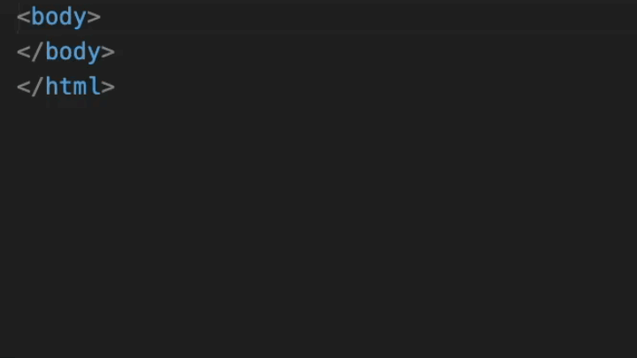

# Using VS Code

As an additional helper included in the `@fluentui/web-components` package is HTML custom data.



To use this, reference the custom data file in your VS Code settings:

```json
{
  "html.customData": ["../node_modules/@fluentui/web-components/dist/vscode.html-custom-data.json"]
}
```

**Note:** The path is relative to the root of the project, not the settings file.

Once it has been added, you will need to restart VS Code in order for it to register the new components.
