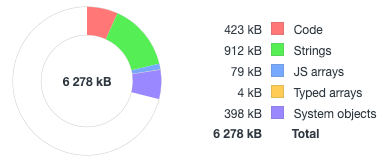
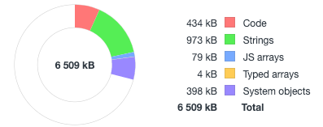
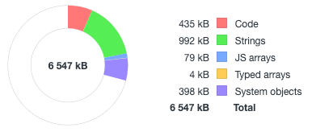
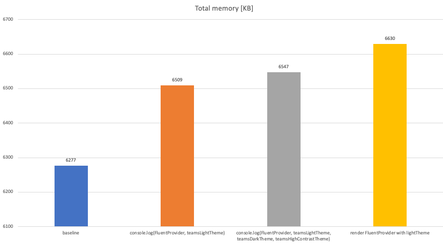
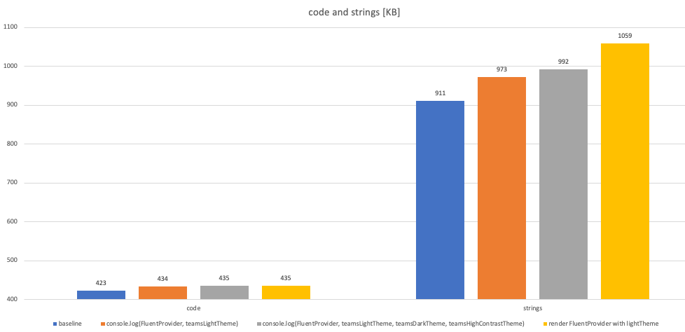
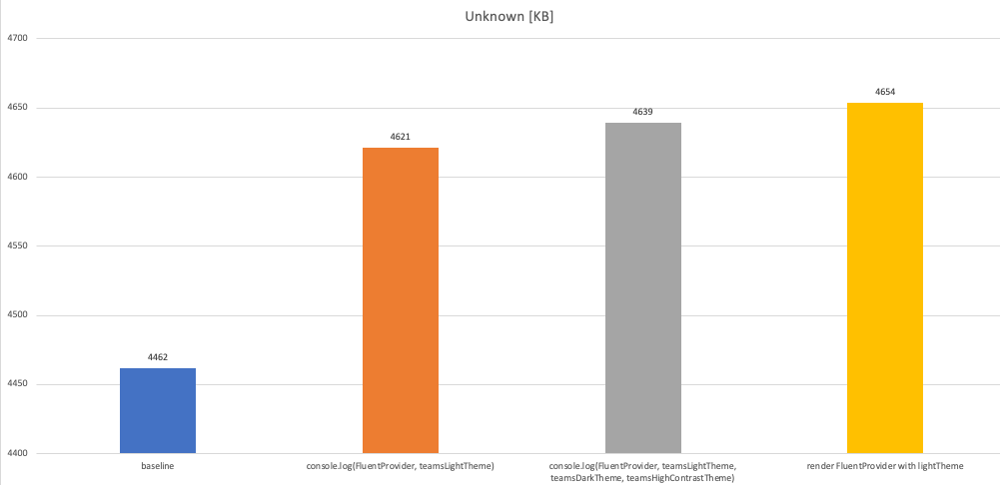

# Memory impact of adding @fluentui/react-components to an application

---

@miroslavstastny

## Summary

Manually measure memory impact of adding @fluentui/react-components to an application.

## Background

Although memory consumption is an important metric contributing to application performance, we currently neither measure it nor gate on its increase.

I manually measured the impact of `FluentProvider` and themes on the heap size. Now we can at least see some numbers and discuss our next steps. 

## Problem statement

Adding `FluentProvider` and `teamsLightTheme` to app code without rendering it takes **232 KB** of memory.

Adding `FluentProvider` and 3 themes (light, dark, HC) to app code without rendering it takes **270 KB** of memory.

Adding `FluentProvider` and the 3 themes to app code and rendering `FluentProvider` with `teamsLightTheme` takes **353 KB** of memory.

## Measurements

### Environment, test scenario
Fluent UI, master as of Jun 3 2021, commit `e7d97fdb85`.
1. run `local-sandbox` app, 
1. use anonymous window in Chrome (90.0.4430.212 on Mac) to render the app 
1. collect garbage several times, take heap snapshot - repeat the step 3 times
1. check the 3rd snapshot stats
1. repeat steps 2-4 3 times to verify the results are stable

With that approach, I tested 4 different codes (see source code later in the doc):
1. **baseline** - empty React app, which renders react-northstar `Provider`, theme and `Button`.
1. **FluentProvider and teamsLightTheme** - the same app as baseline, with added `FluentProvider` and `teamsLightTheme` - these are in the bundle, evaluated in javascript, but not rendered.
1. **FluentProvider and 3 themes** - similar to the previous - baseline, with added `FluentProvider` and `teamsLightTheme`, `teamsDarkTheme` and `teamsHighContrastTheme` - all in bundle and evaluated by javascript, not rendered
1. **Render FluentProvider** - similar to the previous - baseline, added `FluentProvider` and 3 themes but now rendering the `FluentProvider` with `teamsLightTheme`.

#### Baseline
```jsx
import * as React from 'react';
import * as ReactDOM from 'react-dom';
import { Provider, teamsTheme, Button } from '@fluentui/react-northstar';

const App = () => {
  if ((window as any).nope) {
    console.log('');
  }
  return (
    <Provider theme={teamsTheme}>
      <FluentProvider theme={teamsLightTheme}>
        <Button>Click here</Button>
      </FluentProvider>
    </Provider>
  );
};

ReactDOM.render(<App />, document.querySelector('#root'));
```

#### console.log(FluentProvider, teamsLightTheme)
```jsx
import * as React from 'react';
import * as ReactDOM from 'react-dom';
import { Provider, teamsTheme, Button } from '@fluentui/react-northstar';
import { FluentProvider, teamsLightTheme } from '@fluentui/react-components';

const App = () => {
  if ((window as any).nope) {
    console.log(FluentProvider, teamsLightTheme);
  }
  return (
    <Provider theme={teamsTheme}>
      <Button>Click here</Button>
    </Provider>
  );
};

ReactDOM.render(<App />, document.querySelector('#root'));
```

#### console.log(FluentProvider, teamsLightTheme, teamsDarkTheme, teamsHighContrastTheme)
```jsx
import * as React from 'react';
import * as ReactDOM from 'react-dom';
import { Provider, teamsTheme, Button } from '@fluentui/react-northstar';
import { FluentProvider, teamsLightTheme } from '@fluentui/react-components';

const App = () => {
  if ((window as any).nope) {
    console.log(FluentProvider, teamsLightTheme, teamsDarkTheme, teamsHighContrastTheme);
  }
  return (
    <Provider theme={teamsTheme}>
      <Button>Click here</Button>
    </Provider>
  );
};

ReactDOM.render(<App />, document.querySelector('#root'));
```

#### render FluentProvider with lightTheme
```jsx
import * as React from 'react';
import * as ReactDOM from 'react-dom';
import { Provider, teamsTheme, Button } from '@fluentui/react-northstar';
import { FluentProvider, teamsLightTheme, teamsDarkTheme, teamsHighContrastTheme } from '@fluentui/react-components';

const App = () => {
  if ((window as any).nope) {
    console.log(FluentProvider, teamsLightTheme, teamsDarkTheme, teamsHighContrastTheme);
  }
  return (
    <Provider theme={teamsTheme}>
      <FluentProvider theme={teamsLightTheme}>
        <Button>Click here</Button>
      </FluentProvider>
    </Provider>
  );
};

ReactDOM.render(<App />, document.querySelector('#root'));
```

### Measured numbers

#### Baseline


#### console.log(FluentProvider, teamsLightTheme)


#### console.log(FluentProvider, teamsLightTheme, teamsDarkTheme, teamsHighContrastTheme)


#### render FluentProvider with lightTheme


#### Comparison


##### Absolute memory in KB

|                                                                                        | code | strings | JS arrays | Typed arrays | System objects | Total | Unknown |
|----------------------------------------------------------------------------------------|-----:|--------:|----------:|-------------:|---------------:|------:|--------:|
| baseline                                                                               | 423  | 911     | 79        | 4            | 398            | 6277  | 4462    |
| console.log(FluentProvider,   teamsLightTheme)                                         | 434  | 973     | 79        | 4            | 398            | 6509  | 4621    |
| console.log(FluentProvider,   teamsLightTheme, teamsDarkTheme, teamsHighContrastTheme) | 435  | 992     | 79        | 4            | 398            | 6547  | 4639    |
| render FluentProvider with lightTheme                                                  | 435  | 1059    | 80        | 4            | 398            | 6630  | 4654    |

##### Memory in KB relative to baseline

|                                                                                        | code | strings | JS arrays | Typed arrays | System objects | Total | Unknown |
|----------------------------------------------------------------------------------------|-----:|--------:|----------:|-------------:|---------------:|------:|--------:|
| baseline                                                                               | 0    | 0       | 0         | 0            | 0              | 0     | 0       |
| console.log(FluentProvider,   teamsLightTheme)                                         | 11   | 62      | 0         | 0            | 0              | 232   | 159     |
| console.log(FluentProvider,   teamsLightTheme, teamsDarkTheme, teamsHighContrastTheme) | 12   | 81      | 0         | 0            | 0              | 270   | 177     |
| render FluentProvider with lightTheme                                                  | 12   | 148     | 1         | 0            | 0              | 353   | 192     |

Adding `FluentProvider` and `teamsLightTheme` to app code without rendering it takes **232 KB** of memory.

Adding `FluentProvider` and 3 themes (light, dark, HC) to app code without rendering it takes **270 KB** of memory.

Adding `FluentProvider` and the 3 themes to app code and rendering `FluentProvider` with `teamsLightTheme` takes **353 KB** of memory.

#### Where the memory is

Heap snapshot memory is split to *Code*, *Strings*, *JS arrays*, *Typed arrays* and *System objects*. There is also memory remaining to sum up to Total memory - this is marked as *Unknown*.

*JS arrays*, *Typed arrays* and *System objects* are the same in all four scenarios.

*Code*, *Strings* and *Unknown* differ. *Code* grows by just 12 KB, but strings grow by 148 KB. 



### Conclusion

Adding `FluentProvider` and 3 themes and rendering the provider with one of the themes increases used memory by 358 KB.

This is expected as the themes contain definitions of all global and alias design tokens in all tree themes (thousands of tokens each).

We should analyze the impact further and see what optimizations we can make.

Also we should consider adding tests and PR gates to watch this metric continually. 
