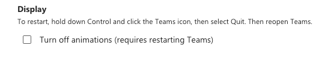

# RFC: Disabling animations

<!--
An RFC can be anything. A question, a suggestion, a plan. The purpose of this template is to give some structure to help folks write successful RFCs. However, don't feel constrained by this template; use your best judgement.

Tips for writing a successful RFC:

- Simple plain words that make your point, fancy words obfuscate
- Try to stay concise, but don't gloss over important details
- Try to write a neutral problem statement, not one that motivates your desired solution
- Remember, "Writing is thinking". It's natural to realize new ideas while writing your proposal
-->

---

@miroslavstastny

## Summary

This RFC describes how animations and transitions in Fluent UI components can be disabled.

## Background

Before adding motion tokens to `react-theme`, we should know how to disable applications during runtime. V8 has
not had a feature disable animations, whereas V0 leverages is CSS in JS framework to strip animations at runtime.

## Problem statement

An application needs a way to disable animations due to following reasons:

- User accessibility.
- Stable screenshot tests.
- Performance on low-end devices.

Users can choose to disable animations in application settings:



There is currently no known requirement to reduce motion (use less or slower/faster animations).

## Detailed Design or Proposal

The recommended solution will involved both Fluent and consumer Apps.

### `prefers-reduced-motion` media query

For animations/transitions in Fluent,
we should leverage the [prefers-reduced-motion](https://developer.mozilla.org/en-US/docs/Web/CSS/@media/prefers-reduced-motion) media query.
All animations that should be toned down within Fluent should declare an alternative style using the media
query. This is the same approach that we follow with high contrast mode proposed in [#17465](https://github.com/microsoft/fluentui/issues/17465).

The below sample code is available on a [demo in codesandbox](https://codesandbox.io/s/pedantic-cdn-dmdgem?file=/example.tsx:111-831).

```ts
import { Button, ButtonProps, makeStyles } from '@fluentui/react-components';
import * as React from 'react';

const useStyles = makeStyles({
  animations: {
    animationDuration: '2s',
    animationTimingFunction: 'linear',
    animationIterationCount: 'infinite',
    animationFillMode: 'both',
    '@media(prefers-reduced-motion)': {
      animationName: {
        '0%': {
          opacity: 1,
        },
        '50%': {
          opacity: 0.8,
        },
        '100%': {
          opacity: 1,
        },
      },
    },
    animationName: {
      '0%': {
        transform: 'scale(1)',
      },
      '25%': {
        transform: 'scale(0.9)',
      },
      '50%': {
        transform: 'scale(1)',
      },
      '75%': {
        transform: 'scale(1.1)',
      },
      '100%': {
        transform: 'scale(1)',
      },
    },
  },
});

const Example = (props: ButtonProps) => {
  const styles = useStyles();
  return (
    <Button appearance="primary" className={styles.animations}>
      Example
    </Button>
  );
};
```

### Global CSS override in apps

We recommend users to use the [prefers-reduced-motion](https://developer.mozilla.org/en-US/docs/Web/CSS/@media/prefers-reduced-motion),
since that gives cross platform support without addtional performance costs
of specific selectors or JavaScript runtime. Additionally, _**not all animations need to be disabled**_, and limited
animations like colour change are still acceptable for users that need reduced motion.

As an escape hatch, applications can add a CSS rule with `!important` property which will override all the animations and transitions on the page. This can
be done on the application side, and will impact all non-Fluent UI styles. This can be useful for browser screenshot
tests that should not screenshot the state of an animation.

```css
*,
*::before,
*::after {
  animation-delay: -1ms !important;
  animation-duration: 1ms !important;
  animation-iteration-count: 1 !important;
  scroll-behavior: auto !important;
  transition-duration: 0.1s !important;
  transition-delay: 0.1s !important;
}
```

This global CSS approach is also recommended by [MUI](https://mui.com/getting-started/faq/#how-can-i-disable-transitions-globally).
We go further by overriding animation duration to imperceptible levels so that we don't break
[features that use animation events](https://codesandbox.io/s/disable-animations-important-with-events-dx38w6?file=/src/AnimatedCircle.tsx:496-563),
this is recommended by [this blog post](<https://web.dev/prefers-reduced-motion/#(bonus)-forcing-reduced-motion-on-all-websites>).

Codesandbox: https://codesandbox.io/s/disable-animations-important-dpugv

### Pros

- 👍 disables all animations on the page
- 👍 not coupled with tokens/griffel
- 👍 Can be used to disable animations
- 👍 Can be used to customize reduced animations
- 👍 Supported cross platform
- 👍 No extra javascript execution
- 👍 Only affects Fluent code

### Cons

- 👎 Only affects animations in Fluent components
- 👎 More effort on the developer to do the right thing

## Discarded Solutions

### Filter rules in `DOMRenderer`

Filter out `animation*` and `transition*` CSS properties before adding them to DOM.

Stardust uses this approach to disable [disable animations](https://github.com/microsoft/fluentui/blob/3360b45ec159250b1346c91afad7dce138e6bc20/packages/fluentui/react-northstar-emotion-renderer/src/disableAnimations.ts). The linked solution does not handle `transition`, only `animation`.
Similar implementation is doable with Griffel, there is `unstable_filterCSSRule` in `DOMRenderer` - with that we can filter out all transition and animation CSS properties.

Codesandbox: https://codesandbox.io/s/disable-animations-filter-80d4i

#### Pros

- 👍 Disables all animations in `makeStyles` no matter whether tokens or direct values have been used to style the animation.

#### Cons

- 👎 Does not disable animations in styles which are not processed by `makeStyles` (inline `style`).
- 👎 There might be a small perf hit to filter the CSS rules.
- 👎 Requires page reload to disable animations (Griffel can only filter CSS during insertion to DOM, it never removes CSS).

### Override duration motion tokens to 0

All animations are supposed to be styled using theme tokens, including the animation timings.
To disable the animations, we can set all the tokens for duration to 0.

#### Pros

- 👍 Can be enabled/disabled during runtime

#### Cons

- 👎 Requires additional theme merging
- 👎 Only disables animations which use design tokens for the duration
