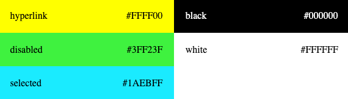

# RFC: High Contrast theme

---

_List contributors to the proposal here_: @miroslavstastny @ling1726

## Summary

High contrast theme should use system colors if user enables forced colors in their Windows settings.

## Problem statement

`react-components` contains a hard coded color theme that matches the colour palette of the default dark Windows 10 High Contrast theme.
Since the addition of this theme can cause confusion for users, this RFC tries to clarify the approach taken by `@fluentui/react-components`
to support high contrast modes.

## Detailed Design or Proposal

It is important to state that **Windows high contrast mode is supported by default in Fluent UI**. Furthermore,
using Windows high contrast mode is recommended to all customers that are using Fluent UI. The sections below
will explain the implementation and the reasoning behind a separate hard coded high contrast theme withith Fluent UI.

### Windows implementation

> The general guidance for Windows high contrast mode is to do as little as possible and only intervene when the OS color palette is insufficient.
> Fluent UI has first class accessibility support in Windows high contrast mode.

In Windows 10 (version 1909) user can enable HC theme in system settings and also customize colors used. These settings are reflected in modern browsers (tested in Chrome 89 and Edge 89) by using `forced-colors` and `prefers-color-scheme` media queries:

```css
@media (forced-colors: active) {
  /* HC is enabled in Windows */

  @media (prefers-color-scheme: light) {
    /* The HC theme is dark on light */
  }

  @media (prefers-color-scheme: dark) {
    /* The HC theme is light on dark */
  }
}
```

More details are available in [Edge blog: Styling for Windows high contrast with new standards for forced colors](https://blogs.windows.com/msedgedev/2020/09/17/styling-for-windows-high-contrast-with-new-standards-for-forced-colors/).

Besides the media query, [CSS system colors](https://www.w3.org/TR/css-color-4/#css-system-colors) are set to match the colors defined by the HC theme. User can customize following colors which are then used to theme the UI:

- `CanvasText`
- `Canvas`
- `LinkText`
- `GrayText`
- `HighlightText`
- `Highlight`
- `ButtonText`
- `ButtonFace`

#### High Contrast Black (Windows built-in, matches FUI HC theme)


#### High Contrast White (Windows built-in)


#### High Contrast with custom user-defined colors


The screenshots are from a [codesandbox showing the usage of CSS system colors](https://codesandbox.io/s/high-contrast-1usny?file=/index.html) to render the same layout as Windows settings dialog for HC.

### Implementation in FUI theme

Current HC FUI theme uses the following five colors - `white`, `black`, `hyperlink`, `disabled`, `selected`:
.

The implementation of the hard coded high contrast theme in Fluent UI, is mainly driven by designers. The existence
of this theme (rather than allowing OS to handle all high contrast theming) is driven by the fact that not all
platforms can be controlled by the operating system. For example, the Electron browser does not recognize input
from the operating system about `forced-colors`. MacOS uses its own propietary color inverting as a means of support
for high contrast which does not follow Windows. In these scenarios it would be appropriate to use the hard coded
high contrast theme to either add high contrast support where there is none, or ensure some level of consistency
with the Windows operating system.

While there are benefits of providing a theme that provides more contrast than others, it is not necessary. The reasons
for this theme are the result of technical contraints for certain platforms and a certain amount of legacy.
Users should be warned that for the highest class of accessibility support, apps need to fully support windows high
contrast mode. This theme does not contribute to that goal.

### Other operating systems

Only Windows currently supports High Contrast theme with user defined colors and `forced-colors` media query. High contrast theme with system colors will be only supported on Windows.
