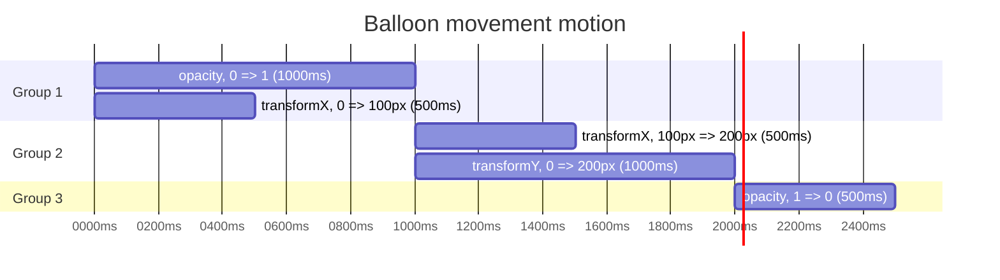

# RFC: Motion definition & APIs for Fluent UI React

[@layershifter](https://github.com/layershifter)

<!-- START doctoc generated TOC please keep comment here to allow auto update -->
<!-- DON'T EDIT THIS SECTION, INSTEAD RE-RUN doctoc TO UPDATE -->

- [Summary](#summary)
- [Background](#background)
  - [Motion definition](#motion-definition)
  - [Motion APIs](#motion-apis)
  - [Motion usage & replacement](#motion-usage--replacement)
- [Web Animations API over CSS way](#web-animations-api-over-css-way)
  - [Performance & re-renders](#performance--re-renders)
    - [State lifecycle for CSS option](#state-lifecycle-for-css-option)
    - [State lifecycle for Web Animations API](#state-lifecycle-for-web-animations-api)
    - [Sample profiles](#sample-profiles)
  - [Web Animations are framework-agnostic](#web-animations-are-framework-agnostic)
  - [No need to sync CSS & JS like with CSS option](#no-need-to-sync-css--js-like-with-css-option)
  - [Potential limits in API with CSS option](#potential-limits-in-api-with-css-option)
- [Detailed design](#detailed-design)
  - [Motion definition](#motion-definition-1)
  - [Using atom motions](#using-atom-motions)
  - [Using presence motions](#using-presence-motions)
  - [Using group motions](#using-group-motions)
  - [Motion overrides](#motion-overrides)
- [Discarded solution (CSS option)](#discarded-solution-css-option)
  - [Motion definition](#motion-definition-2)
  - [Using atom motions](#using-atom-motions-1)
    - [Apply classes to an element](#apply-classes-to-an-element)
    - [Factories](#factories)
  - [Using presence motions](#using-presence-motions-1)
    - [Factories & utility components](#factories--utility-components)
  - [Using group motions](#using-group-motions-1)
  - [Motion overrides](#motion-overrides-1)
    - [Using `motion` & `className` props](#using-motion--classname-props)
    - [Using `motion` prop as object](#using-motion-prop-as-object)
- [Migration plan](#migration-plan)
- [Notes](#notes)
  - [Web Animations API have higher priority in applying styles](#web-animations-api-have-higher-priority-in-applying-styles)
- [Out of scope](#out-of-scope)
  - [Split definition & APIs](#split-definition--apis)
  - [Mouse over / focus / active states](#mouse-over--focus--active-states)
  - [Advanced reduced motion support](#advanced-reduced-motion-support)
  - [Motion sequencing & grouping](#motion-sequencing--grouping)

<!-- END doctoc generated TOC please keep comment here to allow auto update -->

## Summary

This RFC proposes the way to define motion animations and APIs to use them in Fluent UI React components (`@fluentui/react-components`).

## Background

There are three main use cases that this RFC is trying to solve:

- **Motion definition**: How should motion animations be defined?
- **Motion APIs**: Which APIs should be exposed for utilizing motions in Fluent UI React components?
- **Motion usage & replacement**: How can motions be used and overridden in Fluent UI React components?

### Motion definition

_This problem is interconnected with APIs._

[CSS keyframes](https://developer.mozilla.org/en-US/docs/Web/CSS/@keyframes) represent the most common method for defining motion animations in web development.
Currently, there are two approaches for their utilization: [via CSS @keyframes](https://developer.mozilla.org/en-US/docs/Web/CSS/@keyframes) & [via Web Animations API](https://developer.mozilla.org/en-US/docs/Web/API/KeyframeEffect).

We need to decide which option we should go with:

- Utilizing CSS keyframes allows us to define animations in CSS and _use them in JavaScript_ if we will use Griffel. However, these definitions will be tied to Griffel and lack portability.
- Opting for the Web Animations API enables us to define animations in JavaScript and use them in JavaScript. This approach ensures framework-agnostic and portable animations.

### Motion APIs

Based on the motion definition, we need to establish APIs for using them in Fluent UI components and for consumers. There are three primary scenarios:

- **Static motion**: The animation plays when the element is mounted and continues playing if it's looped, [for example](https://www.w3schools.com/cssref/tryit.php?filename=trycss3_keyframes).
- **Presence motion**: The animation plays on mount and reverses on unmount, known as "in/out" animation. For example, [Transition](https://reactcommunity.org/react-transition-group/transition) component from `react-transition-group`.
- **Presence group motion**: The animation utilizes presence motion for items within a group when they are added/removed. For example, [TransitionGroup](https://reactcommunity.org/react-transition-group/transition-group) component from `react-transition-group`.

With CSS based or Web Animations API based motion definition, we need to define a set of APIs to satisfy all these scenarios.

### Motion usage & replacement

- We incorporate motions into components as motions are part of their specifications (`Accordion`, `Dialog`, `Popover`, etc.).
- Consumers should be able to replace them on the component level. For example, apply a different motion to the `Dialog` component.

The APIs should be intuitive, easy to use, and should not negatively affect performance. For example, we should avoid design solutions that increase component re-renders ([microsoft/fluentui#29718](https://github.com/microsoft/fluentui/issues/29718)).

## Web Animations API over CSS way

**While this RFC advocates for the Web Animations API as the preferred option, we have also explored the CSS option (check discarded option section) and are actively seeking feedback from the community.**

### Performance & re-renders

CSS option requires us to apply CSS classes to elements to start animations. The reliable way to do it is to use state machines, for example:

```tsx
const [visible, setVisible] = useState(false);
const [animationState] = useAnimationState(visible);

const className = mergeClasses(
  animationState === 'entering' && classes.entering,
  animationState === 'exiting' && classes.exiting,
);
```

#### State lifecycle for CSS option

This implies that components must be re-rendered to apply classes when the state changes. The typical scenario for "in" transition with CSS option is:

- 💤Idle state
- ⚡️Render 1 (`{ visible: false, animationState: 'idle' }` => `{ visible: true, animationState: 'entering' }`)
- ⏳Animation starts & finished
- ⚡️Render 2 (`{ visible: true, animationState: 'entering' }` => `{ visible: true, animationState: 'idle' }`)

#### State lifecycle for Web Animations API

On the other hand, the Web Animations API doesn't need to be within the React lifecycle as animations have their own lifecycle & apply styles directly to elements. The typical scenario for "in" transition is:

- 💤Idle state
- ⚡️Render 1 (`{ visible: false }` => `{ visible: true }`)
- ⏳Animation starts & finished

> Note: compared to CSS option that we don't need to re-render the component to apply classes

#### Sample profiles

- For these profiles `@fluentui/react-motions-preview` (Web Animations API), `react-transition-group` (CSS implementation) & `@fluentui/react-motion-preview` (CSS implementation) packages were used
- Profiles were taken for "transition in" animation
- Profiles were taken on M1 Max with 6x slowdown
- Lower is better

[An example on StackBlitz](https://stackblitz.com/edit/stackblitz-starters-sedgyk)

##### `@fluentui/react-motion-preview` (CSS option) - ⚡️ 5 renders (6 due a bug)


> Note: currently `useMotion()` hook does 5 renders (`unmounted` => `entering` (`{active: false }`) => `entering` (`{active: true }`) => `entered` => `idle`)

> Note2: currently `useMotion()` hook does 6 due a bug, see [microsoft/fluentui#29719](https://github.com/microsoft/fluentui/issues/29719)

##### `react-transition-group` (CSS option) - ⚡️ 3 renders


> Note: `react-transition-group` does actually 3 renders (`unmounted` => `entering` => `entered`)

##### `@fluentui/react-motions-preview` (Web Animations API) - ⚡️ 1 render


### Web Animations are framework-agnostic

The Web Animations API is framework-agnostic, allowing motion definitions, such as design tokens for motion, to be re-implemented with other tools, including Web Components.

### No need to sync CSS & JS like with CSS option

With the CSS option, we need to apply classes to elements to start animations and remove them to stop animations. This process requires JavaScript code with timers to switch states. However, it's important to note that animation durations are defined in CSS, and values should be synchronized with JavaScript, which can be accomplished using [`.computedStyleMap()`](https://developer.mozilla.org/en-US/docs/Web/API/Element/computedStyleMap) or with [`.getComputedStyle()`](https://developer.mozilla.org/en-US/docs/Web/API/Window/getComputedStyle) for older browsers.

[Implementation in `@fluentui/react-motion-preview`](https://github.com/microsoft/fluentui/blob/f2f299de19e9f8a2bb89610cc3d2a9f66b8d40d9/packages/react-components/react-motion-preview/src/utils/dom-style.ts#L183-L197)

However, this is not necessary at all with the Web Animations API, as durations are defined in a single place.

### Potential limits in API with CSS option

As classes should be applied to elements, our API contract would require users to pass and merge them properly in their components.

```ts
function Fade() {
  const classes = useStyles();
  const state = useAnimationState();

  return React.cloneElement(props.children, { className: mergeClasses(props.children.className, classes[state]) });
}
```

<details>
<summary>Why is this a problem?</summary>

The problem comes from our inability to enforce this contract. For instance, we cannot ensure that the child element will apply classes from props. The typical scenario is as follows:

```tsx
function MyButton() {
  return <Button>Hello world!</Button>;
}

function App() {
  return (
    <>
      {/* 🟢 works as Button handles classes properly */}
      <Fade>
        <Button />
      </Fade>
      {/* 🔴 fails as MyButton does not handle classes properly */}
      <Fade>
        <MyButton />
      </Fade>
    </>
  );
}
```

To make it work in this scenario, `MyButton` should handle the `className` prop:

```tsx
function MyButton() {
  return <Button className={props.className}>Hello world!</Button>;
}
```

The issue is that there is no way to enforce it in the API contract.

</details>

> Note: both CSS and Web Animations API options require to pass refs to elements, but that's easier to enforce as we check that a child uses `React.forwardRef()`.

## Detailed design

The proposed solution relies on the [Web Animations API](https://developer.mozilla.org/en-US/docs/Web/API/Web_Animations_API) and proposes to use the factories pattern to create React components for animating elements.

> Note: The proposal primarily concentrates on low-level APIs for motion. However, following additional discussions with design teams, we might lean towards exporting prebuilt components with predefined motions, such as `Collapse`, `Fade`, `Scale`, etc.
>
> In any case, the proposed APIs will be exported to enable the creation of custom motions.

<details>
<summary>Why factories over hooks?</summary>

To execute animations, we need a motion definition to create an animation. With hooks, this definition can be defined also inside a component, as illustrated below:

```tsx
// ⚠️ This is not proposed API, it's just an example

function MyComponent() {
  const motionRef = useAtomMotion({
    keyframes: [{ opacity: 0 }, { opacity: 1 }],
    duration: 2000,
  });

  return <div ref={motionRef}>Hello world!</div>;
}
```

This approach presents a design issue: on every render, a new definition object is created and passed to the hook. At the same time, the motion must be a dependency to start the animation. Consequently, a new animation is created and started on every render, as depicted in the example below:

```tsx
function useAtomMotion(motion) {
  const elementRef = React.useRef();

  React.useEffect(() => {
    const animation = elementRef.current.animate(motion.keyframes, {
      duration: motion.duration,
    });

    return () => {
      animation.cancel();
    };
  }, [motion]);
}
```

With the factories pattern, the same problem is not possible, as a motion is defined outside a component, as shown below:

```tsx
function createMotionComponent(motion) {
  return React.forwardRef((props, ref) => {
    const elementRef = React.useRef();

    React.useEffect(() => {
      elementRef.current = elementRef.current.animate(motion.keyframes, {
        duration: motion.duration,
      });

      return () => {
        elementRef.current.cancel();
      };
      // `motion` does not need to be a dependency as it's defined outside the component
    }, []);

    return React.cloneElement(props.children, { ref: elementRef });
  });
}
```

</details>

### Motion definition

As the Web Animations API is framework-agnostic, we don't need to use Griffel to generate CSS keyframes. Instead, we can define them in JS:

```tsx
const fadeEnterSlow: AtomMotion = {
  keyframes: [{ opacity: 0 }, { opacity: 1 }],

  duration: 500,
};
```

<details>
<summary>What about CSS variables & tokens?</summary>

The proposal suggests using JavaScript-based tokens instead of CSS variables, for example:

```tsx
const fadeEnterSlow: AtomMotion = {
  keyframes: [{ opacity: 0 }, { opacity: 1 }],

  duration: motionTokens.durationSlow,
};
```

In the same time, CSS variables can be used inside `keyframes` directly:

```tsx
import { tokens } from '@fluentui/react-components';

const flash: AtomMotion = {
  keyframes: [
    { backgroundColor: 'white' },
    // 💡`tokens.colorBrandBackground` is a CSS variable i.e. `var(--colorBrandBackground)`
    { backgroundColor: tokens.colorBrandBackground },
    { backgroundColor: 'white' },
  ],

  duration: 500,
};
```

However, challenges arise with options like `duration` and `easing` since they should be plain values, not CSS variables, as shown below:

```tsx
const atom: AtomMotion = {
  // Heads up! `duration` is in milliseconds and `easing` is a string
  // ⚠️ We can't use CSS variables there
  duration: motionTokens.durationSlow,
  easing: motionTokens.accelerateMax,
};
```

Does this mean that CSS variables can't be used for them at all? **No**, as motions can also be defined as factories that accept an animated element as an argument:

```tsx
// ⚠️ This is not proposed API, it's just an example

const motion: AtomMotionFn = element => {
  const computedStyle = getComputedStyle(element);

  return {
    duration: Number(computedStyle.getPropertyValue('--durationUltraSlow').replace('ms', '')),
    easing: computedStyle.getPropertyValue('--curveAccelerateMax'),
  };
};
```

While this approach should not be commonly used, it's worth noting that it's possible.

[An example on StackBlitz](https://stackblitz.com/edit/stackblitz-starters-eqp8gv)

</details>

### Using atom motions

The proposal is to expose factories as they provide more flexibility and can be used with custom motion definitions.

```tsx
import { type AtomMotion, createMotionComponent, motionTokens } from '@fluentui/react-motions-preview';

// 💡Consumers will have the option to use either predefined motions as objects or as components.
//   They won't need to define custom motions unless they specifically want to.
const fade: AtomMotion = {
  keyframes: [{ opacity: 0 }, { opacity: 1 }],
  duration: motionTokens.durationUltraFast,
};

const FadeEnterSlow = createMotionComponent(fade);

function MyComponent() {
  return (
    <FadeEnterSlow iterations={Infinity}>
      <div>Hello world!</div>
    </FadeEnterSlow>
  );
}
```

> Note: `createMotionComponent()` returns a React component that clones the child element and applies the provided animation to it.

<details>
  <summary>Optional utility components?</summary>

We can also expose a set of pre-defined components, for example:

```tsx
import { Collapse } from '@fluentui/react-motions-preview';

function MyComponent() {
  return (
    <Collapse>
      <div>Hello world!</div>
    </Collapse>
  );
}
```

Since we need to expose factories regardless for creating custom motions, the proposal suggests exposing them as the API.

</details>

<details>
  <summary>Why not follow `styled-components` / `framer-motion` API?</summary>

Another API approach might be to compose existing components with motion factories, for example:

```tsx
// ⚠️ This is not proposed API, it's just an example

import { Button } from '@fluentui/react-components';
import { type AtomMotion, createMotionElement } from '@fluentui/react-motions-preview';

const fade: AtomMotion = {
  /* --- */
};

const FadeEnterDiv = createMotionElement('div', fade);
const FadeEnterButton = createMotionElement(Button, fade);

function MyComponent() {
  return (
    <>
      <FadeEnterDiv>Hello world!</FadeEnterDiv>
      <FadeEnterButton>Hello world!</FadeEnterButton>
    </>
  );
}
```

This approach does not have obvious pros or cons, but it's worth noting that every animated component will have to be composed, for example:

```tsx
// ⚠️ This is not proposed API, it's just an example

import { Button, Image } from '@fluentui/react-components';
import { createMotionComponent, createMotionElement, atom } from '@fluentui/react-motions-preview';

const fade: AtomMotion = {
  /* --- */
};

const FadeEnter = createMotionComponent(fade);

const FadeEnterButton = createMotionElement(Button, fade);
const FadeEnterImage = createMotionElement(Image, fade);

function MyComponent() {
  return (
    <>
      <FadeEnter>
        <div>Hello world!</div>
      </FadeEnter>
      <FadeEnter>
        <Button>Hello world!</Button>
      </FadeEnter>

      {/* vs */}

      <FadeEnterDiv>Hello world!</FadeEnterDiv>
      <FadeEnterButton>Hello world!</FadeEnterButton>
    </>
  );
}
```

</details>

### Using presence motions

Compared to the CSS option, we don't need to apply classes to the element, so factories don't need to control state and won't suffer from the same issues as the CSS option with re-rendering.

> The Web Animations API has its own state machine [by design](https://developer.mozilla.org/en-US/docs/Web/API/Animation/playState), so we can subscribe, for example, to the onfinish event to handle unmount.

<details>
<summary>Handling unmount using animation events</summary>

`createPresenceComponent()` does this internally, this example is just for illustration purposes on how animation events can be used with React lifecycle.

```tsx
// ⚠️ Not proposed API, just an example of Web Animations API usage

function MyComponent(props) {
  const { visible, motion } = props;

  const [mounted, setMounted] = useState(visible);
  const elementRef = React.useRef();

  // Triggers an animation when `visible` prop becomes `false` and unmounts the component on finish
  React.useEffect(() => {
    if (!visible) {
      const animation = elementRef.current.animate(motion.keyframes, {
        duration: motion.duration,
      });

      animation.onfinish = () => {
        setMounted(false);
      };
    }
  }, [visible, motion]);

  return mounted ? props.current : null;
}
```

</details>

It's important to understand that `createPresenceComponent()` relies on `PresenceMotion` definitions, which are a combination of `enter` and `exit` motions:

```ts
type PresenceMotion = {
  enter: AtomMotion;
  exit: AtomMotion;
};
```

For example, when using `fadePresence`, it yields a `PresenceMotion` object containing `enter` and `exit` motions:

```ts
const fadeEnter: AtomMotion = {
  /* --- */
};
const fadeExit: AtomMotion = {
  /* --- */
};

const fadePresence: PresenceMotion = {
  enter: fadeEnter,
  exit: fadeExit,
};
```

This structure enables the definition of distinct keyframes and options, such as durations and easing, for entering and exiting transitions.

As with `createMotionComponent()`, the factory returns a React component that clones the child element and applies the provided animation to it:

```tsx
import { createPresenceComponent, type PresenceMotion } from '@fluentui/react-motions-preview';

// 💡 Consumers will have the option to use either predefined motions as objects or as components.
//   They won't need to define custom motions unless they specifically want to.
const fadePresence: PresenceMotion = {
  /* --- */
};
const Fade = createPresenceComponent(fadePresence);

function MyComponent() {
  const [visible, setVisible] = useState(false);

  return (
    <Fade visible={visible}>
      <div>Hello world!</div>
    </Fade>
  );
}
```

Unlike `createMotionComponent()`, a created component has additional props:

- `appear` - whether the animation should play on mount
- `unmountOnExit` - whether the child element should be unmounted on exit
- `onMotionFinish` - a callback which is called when a motion is finished

```tsx
import { createPresenceComponent, type PresenceMotion } from '@fluentui/react-motions-preview';

// 💡 Consumers will have the option to use either predefined motions as objects or as components.
//   They won't need to define custom motions unless they specifically want to.
const fadePresence: PresenceMotion = {
  /* --- */
};
const Fade = createPresenceComponent(fadePresence);

function MyComponent() {
  const [visible, setVisible] = useState(false);

  return (
    <Fade
      appear
      onMotionFinish={(ev, data) => console.log(`A motion was finished (direction: ${data.direction})`)}
      visible={visible}
      unmountOnExit
    >
      <div>Hello world!</div>
    </Fade>
  );
}
```

<details>
<summary>Why not animation events i.e. `onAnimationFinish()`?</summary>

We will support more complex motions later, such as [grouped and sequential](#motion-sequencing--grouping) animations. Since matching interfaces are not implemented in the platform, we may fallback to either a polyfill or implement a custom approach. In any case, we will need to schedule multiple animations to satisfy this use case. Consequently, the [`finish` event](https://developer.mozilla.org/en-US/docs/Web/API/Animation/finish_event) will be called multiple times. For example:

```tsx
<DialogSurface
  onAnimationFinish={() => console.log('onAnimationFinish()')}
  motion={{
    element: ComplexMotion,
    onMotionFinish: () => console.log('onMotionFinish()'),
  }}
/>

// 🖥️ Console output
//    onAnimationFinish()
//    onAnimationFinish()
//    onAnimationFinish()
//    onMotionFinish()
```

- `onAnimationFinish()` is called for every animation upon finishing.
- `onMotionFinish()` is called when all animations defined by `ComplexMotion` have finished.

</details>

### Using group motions

The suggested approach is to create APIs similar to the `react-transition-group` package, for example:

```tsx
import { createPresenceComponent, type PresenceMotion, PresenceGroup } from '@fluentui/react-motions-preview';

// 💡 Consumers will have the option to use either predefined motions as objects or as components.
//   They won't need to define custom motions unless they specifically want to.
const fadePresence: PresenceMotion = {
  /* --- */
};

const Fade = createPresenceComponent(fadePresence);

function App() {
  return (
    <PresenceGroup>
      <Fade>
        <div>Hello world!</div>
      </Fade>
      <Fade>
        <div>Hello world!</div>
      </Fade>
    </PresenceGroup>
  );
}
```

The `PresenceGroup` component handles the cloning and passing of states to children via React Context. Additionally, the `PresenceGroup` component manages the unmounting of children.

<details>
<summary>Reason for an additional component</summary>

Primarily, a component in React can exist in two states: mounted and unmounted. For instance:

```tsx
function App() {
  return (
    <>
      {/* is mounted */}
      {true && <div>Hello world!</div>}
      {/* is unmounted */}
      {false && <div>Hello world!</div>}
    </>
  );
}
```

Once a component is mounted, an animation will play. However, if a component is unmounted - it gets unmounted, and there is no way to delay it 🙁 The simplest example is usage of `Dialog` component:

```tsx
import { Dialog } from '@fluentui/react-components';

function App() {
  const [open, setOpen] = useState(false);

  return (
    <>
      {/* 🟢 Animation will play for "in" & "out" transitions */}
      <Dialog open={open}>Hello world!</Dialog>
      {/* 🔴 Animation will play only "in" transitions */}
      {open && <div>Hello world!</div>}
    </>
  );
}
```

The `TransitionGroup` component from the `react-transition-group` package resolves this issue by keeping children mounted for a while to play an animation. For example:

- 💤Idle state
- ⚡️Child should be unmounted => `TransitionGroup` clones it, starts the animation, and keeps it mounted
- ⏳Animation starts & finishes; the child is then unmounted

</details>

### Motion overrides

The proposed solution suggests introducing a `motion` prop to override the motion used in a component, functioning similarly to the existing Slots API. For example:

```tsx
import { Dialog, DialogSurface } from '@fluentui/react-components';
import { createPresenceComponent } from '@fluentui/react-motions-preview';

// 💡 Consumers will have the option to use either predefined motions as objects or as components.
//   They won't need to define custom motions unless they specifically want to.
const FadeSlow = createPresenceComponent(/* --- */);

function MyComponent() {
  const [open, setOpen] = useState(false);

  return (
    <Dialog open={open}>
      <DialogSurface motion={FadeSlow}>
        <div>Hello world!</div>
      </DialogSurface>
    </Dialog>
  );
}
```

> In this case, `FadeSlow` should be created with `createPresenceComponent()` or adhere to a specific API contract i.e. accept specific props.

<details>
<summary>Why not composition?</summary>

It seems reasonable to consider composing components, as illustrated in the following example:

```tsx
// ⚠️ This is not proposed API, it's just an example

import { Dialog, DialogSurface } from '@fluentui/react-components';
import { createPresenceComponent } from '@fluentui/react-motions-preview';

const FadeSlow = createPresenceComponent(/* --- */);

function MyComponent() {
  const [open, setOpen] = useState(false);

  return (
    <Dialog open={open}>
      {/* 1️⃣ `FadeSlow` is a state controller, state can't be controlled by Dialog */}
      <FadeSlow visible={visible}>
        {/* 2️⃣ Original motion is still in place */}
        <DialogSurface>
          <div>Hello world!</div>
        </DialogSurface>
      </FadeSlow>
    </Dialog>
  );
}
```

However, this approach comes with a few drawbacks:

1. **`FadeSlow` should be controlled**.

   State needs to be lifted up to `MyComponent` to control `FadeSlow`. This introduces issues with re-renders, as discussed in [microsoft/fluentui#29719](https://github.com/microsoft/fluentui/issues/29719). It also makes uncontrolled state pattern unusable.

2. The original motion will not be automatically replaced. As an alternative, we could export a `DialogSurfaceWithoutMotion` component that lacks a built-in motion, but this is not an intuitive solution.

```tsx
// ⚠️ This is not proposed API, it's just an example

import { Dialog, DialogSurfaceWithoutMotion } from '@fluentui/react-components';
import { createPresenceComponent } from '@fluentui/react-motions-preview';

const FadeSlow = createPresenceComponent(/* --- */);

function MyComponent() {
  const [open, setOpen] = useState(false);

  return (
    <Dialog open={open}>
      {/* 1️⃣ `FadeSlow` is a state controller, state can't be controlled by Dialog */}
      <FadeSlow visible={visible}>
        {/* 2️⃣ Original motion is still in place */}
        <DialogSurfaceWithoutMotion>
          <div>Hello world!</div>
        </DialogSurfaceWithoutMotion>
      </FadeSlow>
    </Dialog>
  );
}
```

</details>

To disable motion `null` can be passed similarly to Slots API:

```tsx
<DialogSurface motion={null}>
```

`motion` also will have a longhand form to support motion callbacks:

```tsx
<DialogSurface
  motion={{
    element: FadeSlow,
    onMotionFinish: () => console.log('Motion ended!'),
  }}
/>
```

To allow the integration of Fluent UI React components with third-party motion systems, the `motion` prop will also support a render callback, similar to the Slots API:

```tsx
<DialogSurface
  motion={{
    children: (
      Element /* 1️⃣ default element defined in a component */,
      props /*   2️⃣ props required to control motion */,
    ) => {
      return (
        // 💡CSSTransition comes from "react-transition-group"
        <CSSTransition classNames="my-css-fade" nodeRef={props.ref} timeout={500} in={props.visible}>
          {props.children}
        </CSSTransition>
      );
    },
  }}
/>
```

To maintain consistency between components, the implementation of the motion prop will be provided as a function:

```tsx
import { motionSlot, Collapse } from '@fluentui/react-motions-preview';
import { mergeCallbacks } from '@fluentui/react-utilities';
import * as React from 'react';

function useComponentState(props, ref) {
  const { motion } = props;
  const [open, setOpen] = React.useState(false);

  const state = {
    motion: motionSlot(motion, {
      element: Collapse,
      visible: open,
    }),
  };

  // Heads up! Like other events callbacks on slots, we should merge them
  state.motion.onMotionFinish = mergeCallbacks(state.motion.onMotionFinish, () => {
    /* do something */
  });
}
```

> Note: `onMotionStart()` support is not implemented, but could be added in the future based on requests.

## Discarded solution (CSS option)

This approach relies on CSS keyframes and utilizes Griffel to generate them. To animate elements, CSS classes need to be applied to them.

### Motion definition

Given our use of CSS-in-JS, specifically Griffel, we can define CSS keyframes in JS. For example, we can create a `fadeEnter` animation as follows:

```tsx
import { type GriffelStyle } from '@griffel/react';

const fadeEnterSlow: GriffelStyle = {
  animationName: {
    from: { opacity: 0 },
    to: { opacity: 1 },
  },
  animationFillMode: 'forwards',
  animationDuration: tokens.durationSlow,
  animationTimingFunction: tokens.accelerateMax,
};
```

> Note: We can use CSS variables in the definition, so the existing tokens can be used.

<details>
<summary>Custom type for motion definitions?</summary>

Alternatively, we could use a different type for animation definition. For example, `MotionStyle` to restrict the usage of CSS properties:

```ts
import { type GriffelStyle } from '@griffel/react';

type MotionStyle = Pick<
  GriffelStyle,
  'animationName' | 'animationFillMode' | 'animationDuration' | 'animationTimingFunction'
>;
```

An alternative approach is to design a universal type for motion definitions that can be employed across various CSS-in-JS engines and the Web Animations API.

> Note: Portability would introduce restrictions on the usage of CSS variables in definitions, as they cannot be used with the Web Animations API.

Also, implementing this method would involve creating a helper function to convert it into a Griffel definition. For instance:

```tsx
import { makeStyles, tokens } from '@fluentui/react-components';
import { type CSSMotionAtom, toGriffelStyle } from 'some-pkg';

const fadeEnterSlow: CSSMotionAtom = {
  keyframes: {
    from: { opacity: 0 },
    to: { opacity: 1 },
  },
  fillMode: 'forwards',
  duration: tokens.durationSlow,
  timingFunction: tokens.accelerateMax,
};

const useStyles = makeStyles({
  root: {
    ...toGriffelStyle(fadeEnterSlow),
  },
});
```

While this approach introduces additional complexity, it doesn't offer any significant benefits. Different CSS-in-JS engines provide different APIs, necessitating the creation of a helper function for each.

```tsx
import styled, { keyframes } from 'styled-components';
import { type fadeEnterSlow, toStyledComponents } from 'some-pkg';

const [keyframesCSS, css] = toStyledComponents(fadeEnterSlow);
const fadeIn = keyframes`${keyframesCSS}`;

const FadeInButton = styled.button`
  animation-name: ${fadeIn};
  ${css}
`;
```

However, it's worth noting that this method won't work with plain CSS, as the definitions are created using JS objects.

</details>

### Using atom motions

With Web Animations API, we can apply animations to elements directly. However, with CSS keyframes, we need to apply classes to elements to start animations and there are two ways to do it.

#### Apply classes to an element

This can be accomplished by using it as a CSS class:

```tsx
import { makeStyles } from '@griffel/react';
import { fadeEnterSlow } from 'some-pkg';

const useStyles = makeStyles({
  root: {
    ...fadeEnterSlow,
  },
});

function MyComponent() {
  const styles = useStyles();

  return <div className={styles.root}>Hello world!</div>;
}
```

#### Factories

Alternatively, a factory function can be utilized to create a React component, similar to the approach with the Web Animations API:

```tsx
import { createMotionComponent, fadeEnterSlow } from 'some-pkg';

const FadeEnterSlow = createMotionComponent(fadeEnterSlow);

function MyComponent() {
  return (
    <FadeEnterSlow>
      <div>Hello world!</div>
    </FadeEnterSlow>
  );
}
```

However, as previously highlighted, this approach has a notable drawback: it necessitates the child element to apply classes from props. While this contract is suitable for Fluent UI components, it may encounter issues with custom components.

- The child element _might have_ its own classes, requiring merging.
- The child element _might not_ apply classes from props.

The typical scenario when factories and utility components would fail is below:

```tsx
import { createMotionComponent, fadeEnterSlow } from 'some-pkg';

const FadeEnterSlow = createMotionComponent(fadeEnterSlow);

const CustomComponent = React.forwardRef((props, ref) => {
  // 💥 This breaks the animation
  //    To fix it, we need to merge classes i.e. do `mergeClasses(props.className, "my-classname")`
  return <div className="my-classname" ref={ref} />;
});

function MyComponent() {
  return (
    <FadeEnterSlow>
      <CustomComponent />
    </FadeEnterSlow>
  );
}
```

It's hard to enforce this contract for custom & third-party components.

### Using presence motions

The process is analogous to the previous one, but classes need to be applied to the element based on the visible prop and a state machine. The typical set of states includes:

- `unmounted` - the element is not mounted
- `idle` - the element is mounted and does nothing
- `entering` - the element is mounted and entering
- `exiting` - the element is mounted and exiting

> ⚠️ Heads up!
>
> Having a state implies the existence of state transitions, for example:
>
> - `unmounted` => `entering`
> - `entering` => `idle`
>
> State transitions enforce state updates, i.e. re-renders of the component to apply classes. This is the primary challenge with this approach.

We have implemented this state machine in the `@fluentui/react-motion-preview` package as the `useMotion()` hook. An example is provided below:

```tsx
import { fadeEnterSlow, fadeExitSlow } from 'some-pkg';
import { useMotion } from '@fluentui/react-motion-preview';

const useClasses = makeStyles({
  root: {
    /* some CSS */
  },
  entering: {
    ...fadeEnterSlow,
  },
  exiting: {
    ...fadeExitSlow,
  },
});

function MyComponent() {
  const classes = useClasses();

  const [visible, setVisible] = useState(false);
  const { state, ref } = useMotion(visible);

  return (
    <div ref={ref} className={mergeClasses(classes.root, classes[state])}>
      Hello world!
    </div>
  );
}
```

#### Factories & utility components

An alternative approach is to utilize factories for creating React components. However, a similar issue to atom motions arises: the child element should follow the API contract.

### Using group motions

That would be similar to the Web Animations API approach.

### Motion overrides

That could be done in the same way as with the Web Animations API or with additional approaches.

#### Using `motion` & `className` props

The approach proposed in [microsoft/fluentui#27328](https://github.com/microsoft/fluentui/pull/27328) requires lifting the state controller up in the React tree to manage the motion state.

```tsx
import { makeStyles, Drawer } from '@fluentui/react-components';
import { useMotion } from '@fluentui/react-motion-preview';

const useClasses = makeStyles({
  /* some CSS */
});

function App() {
  const classes = useClasses();

  const [visible, setVisible] = useState(false);
  const motion = useMotion(visible);

  const className = mergeClasses(classes.root, classes[motion.state] /* simplied example */);

  return (
    <>
      <Drawer className={className} open={motion} />
      {/* other components */}
    </>
  );
}
```

The drawback of this approach is described in [microsoft/fluentui#29718](https://github.com/microsoft/fluentui/issues/29718). As the state is lifted up, components inside `<App />` will re-render on every motion state change. Although this issue can be mitigated, this API doesn't inherently guide consumers towards success.

Since this approach relies on merging classes, there isn't an intuitive way to remove the motion from the component.

#### Using `motion` prop as object

To avoid lifting up the state, an option is to pass the `motion` configuration as an object to the component. This approach is similar to the `positioning` prop in the `@fluentui/react-positioning` package.

```tsx
import { makeStyles, Drawer } from '@fluentui/react-components';

const useClasses = makeStyles({
  /* some CSS */
});

function App() {
  const classes = useClasses();
  const [visible, setVisible] = useState(false);

  return (
    <>
      <Drawer open={visible} motion={{ classes }} />
      {/* other components */}
    </>
  );
}
```

Motion could then be removed (disabled) by passing `null`:

```tsx
function App() {
  const classes = useClasses();
  const [visible, setVisible] = useState(false);

  return (
    <>
      <Drawer open={visible} motion={null} />
      {/* other components */}
    </>
  );
}
```

## Migration plan

Currently, we have three approaches to motion in Fluent UI React components:

- `react-transition-group` - CSS based, used in `Dialog`, `Toast`, `MessageBar`.
- `@fluentui/react-motion-preview` - CSS based i.e. `useMotion()`, used in `Drawer`.
- `@fluentui/react-motions-preview` - Web Animations API based i.e. `createMotionComponent()`, not used yet.

We will use the following steps to migrate to the new motion system:

1. Components should be migrated to use `@fluentui/react-motions-preview`.
2. `@fluentui/react-motion-preview` should be deprecated and removed from docs.
   - `useMotion()` from `@fluentui/react-motion-preview` can be moved to [Contrib repo](https://github.com/microsoft/fluentui-contrib).
3. Expose `motion` prop in components for overrides.

## Notes

### Web Animations API have higher priority in applying styles

It's hard to say if it's a pro or con, but the Web Animations API has higher priority in applying styles of CSS properties. This means that users cannot apply CSS to elements that are animated with the Web Animations API and replace motion.

However, they could be combined using [`composite` property](https://developer.mozilla.org/en-US/docs/Web/API/KeyframeEffect/composite).

[An example on Stackblitz](https://stackblitz.com/edit/stackblitz-starters-qgseij)

## Out of scope

### Split definition & APIs

Currently, `@fluentui/react-motions-preview` does not have any motions defined (i.e. fade, collapse, etc.) as there is no final decision on their shape from design team. We can iterate on motion definitions themselves and APIs separately.

### Mouse over / focus / active states

While this RFC is focused on usage of `@keyframes`, simple transitions could be done using [`transition` CSS property](https://developer.mozilla.org/en-US/docs/Web/CSS/transition). For example:

```tsx
import { makeStyles } from '@fluentui/react-components';

const useClasses = makeStyles({
  root: {
    transition: 'opacity 200ms ease-in-out',
    '&:hover': {
      opacity: 0.5,
    },
  },
});
```

This RFC does not cover this scenario, but we can consider it in the future.

### Advanced reduced motion support

Both the CSS and Web Animations API options offer basic support for reduced motion:

- In the CSS option (`useMotion()`), [animations are skipped](https://github.com/microsoft/fluentui/blob/b3c2fa6881e1cee2f326ba80811400596c99112c/packages/react-components/react-motion-preview/src/hooks/useMotion.ts#L108) if `@media (prefers-reduced-motion: reduce)` is true.
  > Note: this approach is not ideal as animation events won't be fired.
- In the Web Animations API option (`createMotionComponent()`, `createPresenceComponent()`) animations are [forced to a duration of 1ms](https://github.com/microsoft/fluentui/blob/b3c2fa6881e1cee2f326ba80811400596c99112c/packages/react-components/react-motions-preview/src/factories/createPresence.ts#L91) if `@media (prefers-reduced-motion: reduce)` is true

It's essential to understand that reduced motion doesn't necessarily imply a reduction in the duration of the animation. For example, in an animation where an element's size and color change, reducing motion might involve retaining the color change while minimizing movement.

For the Web Animations API, it might be feasible to enhance the motion definition with a `reducedMotion` option, as shown in the example below:

```tsx
// ⚠️ This is not proposed API, it's just an example

const fade: AtomMotion = {
  keyframes: [{ opacity: 0 }, { opacity: 1 }],
  duration: 500,

  reducedMotion: {
    duration: 100,
  },
};
const grow: AtomMotion = {
  keyframes: [
    { height: 0, opacity: 0 },
    { height: 100, opacity: 1 },
  ],
  duration: 500,

  reducedMotion: {
    keyframes: [{ height: 0 }, { height: 100 }],
  },
};
```

Factories (`createMotionComponent()`, `createPresenceComponent()`) could utilize this prop to apply different keyframes and options based on the media query.

### Motion sequencing & grouping

Motions can be combined into groups or sequences, for example:



This is outside the scope of this RFC, but it could be considered in the future. The Web Animations API makes it easier to implement, and it can be seamlessly integrated into existing factories since changing animations no longer requires modifying CSS classes.

Implementation is tracked in [microsoft/fluentui#30547](https://github.com/microsoft/fluentui/issues/30547)

[PoC](https://stackblitz.com/edit/stackblitz-starters-ifjobr)
[prototype using existing APIs](https://github.com/microsoft/fluentui/pull/30531)

> **Note:** the draft of [Web Animations Level 2](https://drafts.csswg.org/web-animations-2) contains both [`GroupEffect`](https://drafts.csswg.org/web-animations-2/#group-effect) and [`SequenceEffect`](https://drafts.csswg.org/web-animations-2/#the-sequenceeffect-interface) interfaces to provide this functionality.
