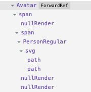

# RFC: Remove `nullRender`

@miroslavstastny

## Summary

Remove `nullRender`, replace it with conditional rendering in `renderComponent` functions.

## Background

We have never measured real performance impact of having a bigger React tree but always wanted to have a minimal and meaningful tree.

## Problem statement

Every component gets all slots to be rendered in `renderComponent` by calling a `getSlots()` function:

```tsx
export const renderAvatar_unstable = (state: AvatarState) => {
  const { slots, slotProps } = getSlots<AvatarSlots>(state);

  return (
    <slots.root {...slotProps.root}>
      <slots.initials {...slotProps.initials} />
      <slots.icon {...slotProps.icon} />
      <slots.image {...slotProps.image} />
      <slots.badge {...slotProps.badge} />
    </slots.root>
  );
};
```

As described in [RFC: Slot null rendering refactoring](./slot-null-rendering.md), when there is a slot which should render nothing (empty slot), `getSlots()` returns a `nullRender` component. With that, the component's render function does not need to do any conditional rendering, the empty slot just renders `null`.

The problem is each `nullRender` is still a component present in React tree:



`nullRenderer` adds bloat to the React tree and also an indirection/abstraction to component source code which can be avoided.

## Detailed Design or Proposal

Remove `nullRender`, `getSlots()` will return `null` for optional slots which should not be rendered.
Add conditional rendering to the render functions for all optional slots:

```tsx
export const renderAvatar_unstable = (state: AvatarState) => {
  const { slots, slotProps } = getSlots<AvatarSlots>(state);

  return (
    <slots.root {...slotProps.root}>
      {!!slots.initials && <slots.initials {...slotProps.initials} />}
      {!!slots.icon && <slots.icon {...slotProps.icon} />}
      {!!slots.image && <slots.image {...slotProps.image} />}
      {!!slots.badge && <slots.badge {...slotProps.badge} />}
    </slots.root>
  );
};
```

Note: there is no condition around `slots.root` as that slot is not optional, see related RFC #21414 (todo: fix link).

### Pros and Cons

- 👍 reduced size of React tree
- 👍 no strange items in the React tree
- 👍 removed indirection, it is clear from the JSX template which slots are optional

- 👎 conditions in render functions, more code

## Discarded Solutions

- **wrap optional slots with a checker function** - This function would check if the renderer component is `nullRender` and just return `null`. Replaces one indirection with another one, still adds code to a render function.
- **custom JSX pragma** - Non trivial config, non-standard (for such a nich thing).
