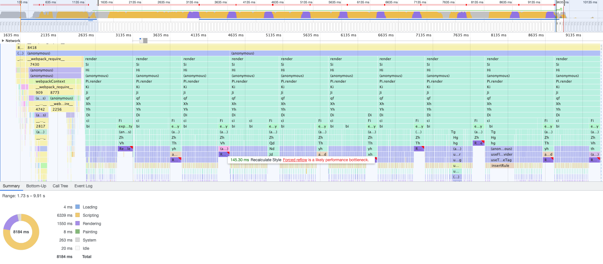
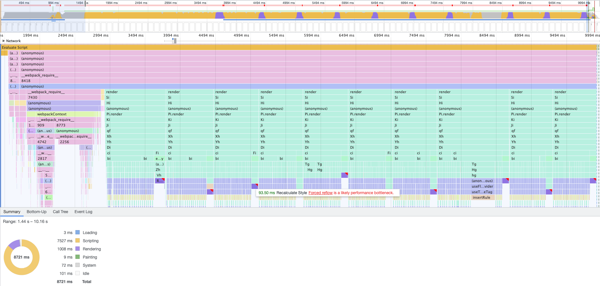
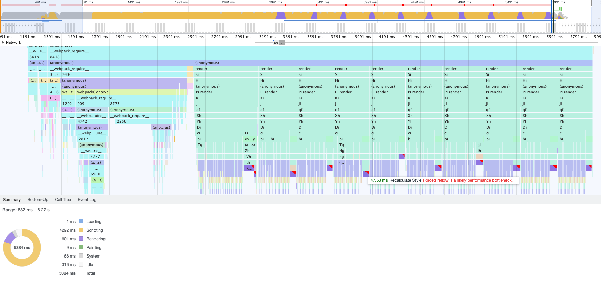
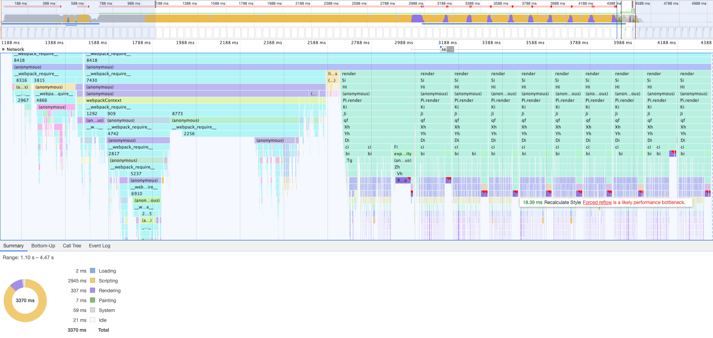
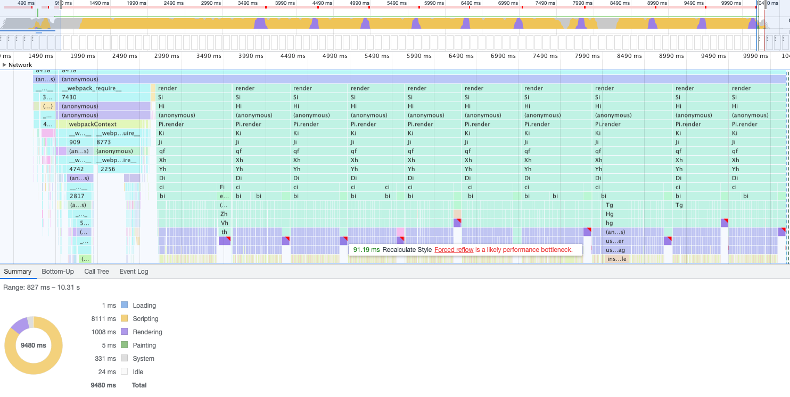
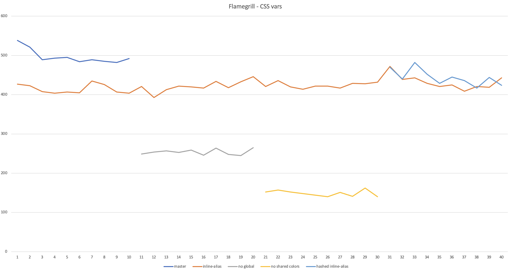

# RFC: Update theme shape

@miroslavstastny, @layershifter

_This RFC updates [theme-tokens.md](./theme-tokens.md) RFC. Once this on is approved, we should merge the two RFCs together._

## Summary

As described in [theme-tokens.md](./theme-tokens.md) the current theme consists of global and alias tokens.
All tokens are injected into DOM as CSS variables, resulting in 1200 CSS variables. With this approach, when a theme switches, there is no need to re-compute any component styles, by just setting the new token values to the CSS variables, all components change their appearance accordingly.

However, 1200 CSS variables in DOM affects browser performance. This RFC proposes ways how to improve theme performance.

## <a name="performance-analysis"></a>Performance analysis

The current theme consists of ~1200 tokens which are injected into DOM as CSS variables. It impacts not only Javascript performance but also browser performance in styles computation phase.

To see the performance impact we render 20 `FluentProvider` components side by side (**each** injecting a class with 1200 CSS variables) - mount and unmount 10 times and measure the performance in Chrome profiler with 6x CPU slowdown. After each mount, a CSS attribute is accessed to force reflow in order to be able to measure the rendering performance.

### Master

Current implementation in `@fluentui/react-theme@9.0.0-alpha.22`.

- 1200 CSS variables in a theme = ~650 global tokens + ~550 alias tokens
- alias token implemented as a "reference" to a global token: `--alias-token: var(--global-token)`.
- **Each reflow takes ~150ms (1500 ms total for the 10 mounts)**



### Inline values to alias tokens.

- Still the same 1200 CSS variables (650 global + 550 alias)
- Instead of "referencing" global tokens in the alias tokens, inline the values: `--alias-token: #fff`.
- **Each reflow takes ~90ms (1000 ms total for the 10 mounts)**



### Reduce number of tokens (CSS variables)

- Removed global color tokens, number of CSS variables reduced to 550.
- **Each reflow takes ~50ms (600 ms total for the 10 mounts)**



### Remove even more tokens

It seems that the rendering performance depends on the number of CSS variables in the DOM. This is an experiment to remove even more variables to verify the hypothesis.

- Removed alias shared color tokens, number of CSS variables reduced to 160.
- **Each reflow takes ~20ms (350 ms total for the 10 mounts)**



### Hash CSS variables

In inline aliases scenario, there are 1200 CSS variables with names like `--alias-color-neutral-neutralStrokeAccessibleHover`. The total string length of CSS variable names (including the leading `--`) is 39,252 characters - is that affecting the perf as well? We used 7-char hashes for variable names to check for any difference - this reduced the string length to 10,354 characters. There is no difference in the performance.

- **Each reflow takes ~90ms (1000 ms total for the 10 mounts)**

**The perf example intentionally uses precomputed hashes to keep the hash computation out of the measured code path.**



### Results Summary

We also used flamegrill to compare the approaches. Inlined aliases is used as a baseline all other approaches are compared to. For each experiment we run the test 10 times for both the experiment and the baseline to get comparable numbers.



## Proposed changes to the theme shape

1. [Inline values in alias tokens](#inline-alias)
2. [Do not inject global color tokens as CSS variables](#no-global-tokens)
3. [Merge global and alias tokens to a single object](#merge-global-alias)
4. [Flatten the tokens object](#flatten-tokens)
5. [Hash variable names](#hash-variables)
6. [Be cautious when adding new tokens to the theme](#be-cautious)
7. [Get rid of all CSS variables](#no-css-vars)

### <a name="inline-alias"></a>Inline values in alias tokens

Global tokens reference values, alias tokens reference the global tokens:

```css
/* Before */
--global-red: #f00;
--alias-error: var(--global-red);
```

Performance analysis shows, that by inlining the values directly into CSS variables for alias tokens we can improve Rendering perf.

Proposed change:

```css
/* After */
--global-red: #f00; /* no change here */
--alias-error: #f00; /* inlined value from --global-red */
```

This change has already been implemented in [#19660](https://github.com/microsoft/fluentui/pull/19660).

### <a name="no-global-tokens"></a>Do not inject global color tokens as CSS variables

The main reason why CSS variables are used is to be able to switch themes just by changing the CSS variables values.

But, by design, global tokens never change their values when switching theme, so there is no point to have them as CSS variables.

The proposal is to **remove global color tokens from the theme object** and **do not inject them to DOM as CSS variables**.

As shown in the [Performance analysis](#performance-analysis) analysis, this reduces the number of CSS variables by a half and significantly improves rendering performance.

#### What if I need global color tokens in component styles or overrides

First of all, using a global color token in styles directly is almost always incorrect as the color does not change when switching themes.

For the rare cases where the global color token is needed, `react-theme` will export all the global tokens.

```js
/* Before */
import { makeStyles } from '@fluentui/react-components';

const useStyles = makeStyles({
  root: theme => ({
    color: theme.alias.color.neutral.neutralStroke1, // color: var(--alias-color-neutral-neutralStroke1)
    background: theme.global.palette.grey[50], // background: var(--global-palette-grey-50)
  }),
});
```

```js
/* After */
import { makeStyles, globalColorTokens } from '@fluentui/react-components';

const useStyles = makeStyles({
  root: theme => ({
    color: theme.alias.color.neutral.neutralStroke1, // color: var(--alias-color-neutral-neutralStroke1)
    background: globalColorTokens.palette.grey[50], // background: '#ddd' 👈 value inlined/bound during babel-plugin/build
  }),
});
```

#### When the global token is bound to the styles?

In the current implementation the global token is injected to the DOM as CSS variable by `FluentProvider` - the theme passed to the `FluentProvider` is the source of truth for all the tokens.

In the proposed implementation, however, the global token value is inlined during the application bundling. That should not be a problem, we do not support changing global token values once the application is built and bundled.

For components developed in isolation this will work as well as the tokens are bound only when the final application is bundled (not when the component is built).

#### `babel-make-styles` consequences

The global tokens are inlined when component styles are processed by `babel-make-styles` plugin.
There are 3 different places, where the plugin can be run:

1. FUI library build - this is not a problem as FUI library currently does not use any global color tokens in component styles (actually there are global color tokens used in `Badge` - this is a bug, to be reported and fixed)
2. Build of a component developed in isolation - this would cause a problem but currently, the plugin is not used here
3. Build of an application - this is the correct place where the global color tokens are supposed to be inlined.

To be safe with the FUI library build (point 1 above) and fix the potential problem when running the babel plugin on a component (point 2), we will consider the following options (**all after beta**):

- Add an option to the babel plugin to fail when a global color token is used (makes point 1 safe as it will protect us from accidentally using global color tokens).
- Modify the babel plugin to keep global color tokens as imports instead of inlining them (fixes point 2 as it moves the binding from babel-plugin in component to bundler in the application).
- Run the babel plugin only in the application build. Neither in the FUI library nor in the component build. Process also `node_modules` (to cover the FUI library and component) during the application build.
- Remove the babel plugin. We can also decide that the babel plugin is not worth the complexity and remove it.

### <a name="merge-global-alias"></a>Merge global and alias tokens to a single object

Having the tokens split to global and alias tokens is definitely a valid concept for design. But does not mean anything to engineers.

**Let's merge the two to a single object in the final theme.**

_(This change has no direct impact on perf, but is required for the [next point](#flatten-tokens).)_

To be able to do this, we need get rid of any naming overlaps between alias and global tokens.
The only potential overlap is in spacing tokens as we have both global and alias spacing tokens -> talk to design to understand which tokens engineers are supposed to use.

Current design token spec also calls out `fontWeights` and `alignment` tokens are "not actual tokens" and should not be used -> talk to design, should we remove them?

### <a name="flatten-tokens"></a>Flatten the tokens object

In Typescript the theme is represented by a deep object:

```js
/* Before */
theme.alias.colors.red.neutral;
```

This brings the three following issues:

1. Engineers might struggle to find the expected token in the object.
2. Theme merging is expensive as we need to merge deep objects.
3. Insertion of CSS variables is more expensive as we need to flatten CSS variables in runtime (`flattenThemeToCSSVariables()`).

**The proposal is to merge all the tokens to a single flat object**:

```js
/* After */
theme.aliasColorsRedNeutral;
```

This should simplify theme merging, improve tokens discoverability. The potential drawback is we are creating a gigantic dictionary of unrelated values.

### <a name="hash-variables"></a>Hash variable names

As described in [Performance analysis](#performance-analysis), total string length of CSS variable names is ~40KB, by hashing the variable names to 7 char hashes, we can reduce this string length by 75%.

The performance analysis shows no perf impact (in rendering phase) by doing so. Also when using the variables in `makeStyles`, we need either hash the names on the fly (perf hit) or reference a dictionary (potential bundle size and memory hit).

Besides the performance, another valid reason for hashing the variable names might be **encapsulation**. Currently, the CSS variable names are deterministic, anybody can use them directly in both CSSInJS and SASS/CSS - this would make the variable names part of the API contract and any variable name change would be a breaking change. Hashing the variable names can prevent this misuse.

**Let's create a separate RFC and have a discussion on this topic after beta.**

### <a name="be-cautious"></a>Be cautious when adding new tokens to the theme

There are currently ~1200 tokens in the theme object. ~1000 of the tokens represent global and alias shared colors which are actually rarely used in products.
80% of tokens rarely used.

**When adding tokens, think about the number of CSS variables added, whether they change during runtime and need to be implemented using CSS variables.**

### <a name="no-css-vars"></a>Get rid of all CSS variables

We have learnt that CSS variables are expensive. Can we get rid of them completely? If we decided to do so, we would need to think about the following problems:

1. Theme switch will recompute the styles. But how often a user changes a theme. I bet this is not on a critical path for performance.
2. We cannot preprocess styles in babel plugin. How would that impact performance.
3. This would complicate SSR as you would need to know the requested theme when doing SSR.

It might be an interesting exercise to explore these but sometime later.
