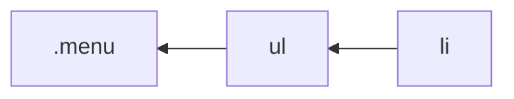

# Styles Handbook

[@layeshifter](https://github.com/layershifter)

This document covers how to efficiently use [Griffel][griffel] CSS-in-JS (used in Fluent UI React v9) to style components.

## Table of contents

<!-- START doctoc generated TOC please keep comment here to allow auto update -->
<!-- DON'T EDIT THIS SECTION, INSTEAD RE-RUN doctoc TO UPDATE -->

- [Introduction](#introduction)
- [Basics](#basics)
- [APIs](#apis)
  - [`makeStyles`](#makestyles)
    - [Limitations](#limitations)
  - [`mergeClasses()`](#mergeclasses)
    - [Do not concatenate classes](#do-not-concatenate-classes)
  - [`makeResetStyles`](#makeresetstyles)
    - [Hybrid approach](#hybrid-approach)
- [Advanced](#advanced)
  - [Understanding selectors complexity](#understanding-selectors-complexity)
- [Best practices](#best-practices)
  - [Writting styles](#writting-styles)
    - [Use `tokens` over direct colors](#use-tokens-over-direct-colors)
    - [Avoid duplication in rule definitions](#avoid-duplication-in-rule-definitions)
    - [Avoid `!important`](#avoid-important)
  - [Performance](#performance)
    - [Avoid nested `mergeClasses` calls](#avoid-nested-mergeclasses-calls)
  - [Nested selectors](#nested-selectors)
    - [Usage with pseudo classes](#usage-with-pseudo-classes)
    - [Do not use selectors to target elements](#do-not-use-selectors-to-target-elements)
    - [Do not introduce complicated selectors](#do-not-introduce-complicated-selectors)
    - [Avoid usage of input pseudo classes](#avoid-usage-of-input-pseudo-classes)
  - [RTL styles](#rtl-styles)
    - [Using `@noflip`](#using-noflip)

<!-- END doctoc generated TOC please keep comment here to allow auto update -->

# Introduction

Griffel is a hybrid CSS-in-JS that features runtime option like any other CSS-in-JS and [Ahead-of-time compilation][griffel-aot] with [CSS extraction][griffel-css-extraction] to reduce runtime footprint and improve performance.

# Basics

Griffel uses Atomic CSS to generate classes. In Atomic CSS every property-value is written as a single CSS rule.

```css
/* Monolithic classes */
/* Can be applied only to a specific button */
.button {
  display: flex;
  align-items: center;
}

/* Atomic CSS */
/* Can be applied to any element that needs there rules */
.display-flex {
  display: flex;
}
.align-items-center {
  align-items: center;
}
```

[Learn more][griffel-atomic-css] about Atomic CSS.

# APIs

## `makeStyles`

Is used to define style permutations in components and is used for style overrides. Returns a [React hook][react-hook] that should be called inside a component:

```jsx
import { makeStyles } from '@griffel/react';

const useClasses = makeStyles({
  button: { display: 'flex' },
  icon: { paddingLeft: '5px' },
});
```

### Limitations

Atomic CSS generates more classes than the approach with monolithic classes. Usually it's not a problem, but there are cases when performance [may degrade][griffel-recalc-performance], for example when elements have more than 100 classes. This does not happen usually as there is a limited set of CSS properties that is applied to a DOM element:

```js
import { makeStyles, shorthands } from '@griffel/react';

const useClasses = makeStyles({
  root: {
    display: 'flex',
    alignItems: 'center',
    ...shorthands.padding('4px'),
  },
});
// ⬇️⬇️⬇️
// produces 6 classes (1+1+4)
```

> 💡**Tip:** To check generated classes consider to use [Try out][griffel-try-out] sandbox.

However, the situation can go out of control with nested selectors, [pseudo classes][mdn-pseudo-classes]/selectors and [At-rules][mdn-at-rules] causing "CSS rules explosion":

```js
import { makeStyles, shorthands } from '@griffel/react';

const useClasses = makeStyles({
  root: {
    ...shorthands.padding('4px'),
    ...shorthands.margin('4px'),

    ':hover': {
      ...shorthands.padding('4px'),
      ...shorthands.margin('4px'),
    },

    '::before': {
      display: 'block',
      content: "' '",
    },

    '@media (forced-colors: active)': {
      ...shorthands.padding('4px'),
      ...shorthands.margin('4px'),
    },
  },
});
// ⬇️⬇️⬇️
// produces 14 classes ((4+4)+(4+4)+2+(4+4))
```

Such cases might be unavoidable by design, next section covers APIs to address this problem.

## `mergeClasses()`

Griffel provides [`mergeClasses() API`][griffel-merge-classes] that is expected to be used in cases with styles permutations:

```js
import { makeStyles, shorthands } from '@griffel/react';

const useClasses = makeStyles({
  root: {
    /* styles */
  },
  foo: {
    /* styles */
  },
  bar: {
    /* styles */
  },
});

function Component(props) {
  const classes = useClasses();
  const className = mergeClasses(
    classes.root,
    props.foo && classes.foo /* styles specific for "foo" */,
    props.bar && classes.bar /* styles specific for "bar" */,
  );

  /* --- */
}
```

### Do not concatenate classes

It is not possible to simply concatenate classes returned by `useClasses()` hooks. Always use `mergeClasses()` to merge classes as results of concatenation can contain duplicated classes and lead to non-deterministic results.

```js
import { makeStyles, mergeClasses } from '@griffel/react';

const useClasses = makeStyles({
  rootA: { display: 'flex' },
  rootB: { display: 'grid' },
});

function App(props) {
  const classes = useClasses();

  // ✅ Returns "class-display-grid"
  const correctClasses = mergeClasses(classes.rootA, classes.rootB);
  // 🔴 Never concatenate class strings, returns "class-display-flex class-display-grid"
  const wrongClasses = classes.rootA + ' ' + classes.rootB;
}
```

## `makeResetStyles`

Is used to define base styles in components avoid the "CSS rules explosion" problem as generates a monolithic class:

```js
import { makeResetStyles } from '@griffel/react';

const useBaseClassname = makeResetStyles({
  padding: '4px',
  margin: '4px',
});
```

> ⚠️ **Note:** Only one class generated by `makeResetStyles()` can be applied to an element. Otherwise, behavior will be non-deterministic as classes merging will not be done for this case and results depend on order of insertion.

### Hybrid approach

Our recommendation is use [`makeResetStyles` API][griffel-make-reset-styles] to define base styles for a component and keep using `makeStyles` for overrides and permutations:

```jsx
import { makeStyles, makeResetStyles, mergeClasses, shorthands } from '@griffel/react';

const useBaseClassname = makeResetStyles({
  ':hover': {
    ...shorthands.padding('4px'),
    /* other styles */
  },
  '::before': {
    display: 'block',
    content: "' '",
  },
  '@media (forced-colors: active)': {
    ...shorthands.padding('4px'),
    /* other styles */
  },
});
// ⬇️⬇️⬇️
// produces 1 class

const useClasses = makeStyles({
  circular: {
    ...shorthands.borderRadius('10px'),
  },
  primary: {
    color: 'pink',
  },
});
// ⬇️⬇️⬇️
// produces 4/1 classes to be conditionally applied

function Component(props) {
  const baseClassName = useBaseClassname();
  const classes = useClasses();

  const className = mergeClasses(baseClassName, props.circular && classes.circular, props.primary && classes.primary);

  return <div className={className} />;
}
```

# Advanced

## Understanding selectors complexity

CSS Selectors are matched by browser engines from [right to left (bottom-up parsing)][stackoverflow-selectors-match]:



```css
.menu ul li {
  color: #00f;
}
```

> The browser first checks for `li`, then `ul`, and then `.menu`.

It means that we need to understand selectors that we are writing and avoid _wide_ selectors. A component below will be used as an example:

```jsx
import { makeStyles } from '@griffel/react';

const useClasses = makeStyles({
  test: {
    color: 'orange',

    '> *': {
      color: 'red',
    },
    '> h1': {
      color: 'magenta',
    },
    '> div': {
      color: 'green',
    },
    '> .ui-button': {
      color: 'blue',
    },
  },
});

function App() {
  const classes = useClasses();

  return (
    <>
      <div className={classes.test}>
        <h1>Hello World</h1>
        <button class="ui-button">A button</button>
      </div>

      {/* Renders 500 empty divs */}
      {Array.from({ length: 500 }, (_, i) => (
        <div key={i} />
      ))}
    </>
  );
}
```

#### Measurements

##### No selector (best)

Matches only an element where is applied.

- selector `.fe3e8s9`
- match_attempts **1**
- match_count **1**

##### `> *` (worst)

"\*" matches any element on a page.

- selector `.fzbuleu > *`
- match_attempts **502**
- match_count **1**

##### `> h1` & `> div` (non ideal)

Targets all `h1` & `div` tags.

- selector `.fohk16y > h1`
- match_attempts **1**
- match_count **1**

In this example performs better as page has a single `h1` tag, this will not be a case in the real app that it is visible on the next example with `div`.

- selector `.fq4d7o6 > div`
- match_attempts **501**
- match_count **1**

#### Targeting a classname (better)

The most effective out there as we target only elements with a specific classname. However, it will not save from the case with 1k buttons in the app.

- selector `.fqhvij7 > .ui-button`
- match_attempts **1**
- match_count **1**

# Best practices

## Writting styles

### Use `tokens` over direct colors

Fluent UI React v9 provides [design tokens][fluent-colors] to provide consistent way of theming via `tokens` provided by `@fluentui/react-theme`.

```js
import { makeStyles } from '@griffel/react';
import { tokens } from '@fluentui/react-theme';

const useClasses = makeStyles({
  // ❌ Don't do
  rootA: { color: 'red' /* brand foreground */ },
  // ✅ Do
  rootB: { color: tokens.colorBrandForeground1 },
});
```

Exact colors should be never used in Fluent UI code and are not recommended by be used in applications. The exception are [system-colors][mdn-system-colors] used by forced colors mode:

```js
import { makeStyles } from '@griffel/react';

const useClasses = makeStyles({
  button: { color: 'ButtonText' },
});
```

### Avoid duplication in rule definitions

Styles written for components should follow these rules:

- base styles should contain the most of CSS definitions that are applicable to base state
- styles for permutations should be granular and don't contain definitions that are present in base styles

```js
import { makeStyles, mergeClasses, shorthands } from '@griffel/react';
import { tokens } from '@fluentui/react-theme';

const useClasses = makeStyles({
  base: {
    display: 'flex',
    color: tokens.colorNeutralForeground1,
    ...shorthands.padding('10px'),
  },
  // ❌ Don't do
  //  "display" & "padding" with the same values are defined in base styles
  primary: {
    display: 'flex',
    ...shorthands.padding('10px'),
    backgroundColor: tokens.colorBrandBackground,
    color: tokens.colorBrandForeground1,
  },
  // ✅ Do
  primary: {
    backgroundColor: tokens.colorBrandBackground,
    color: tokens.colorBrandForeground1,
  },
});

function App(props) {
  const classes = useClasses();
  const className = mergeClasses(classes.base, props.primary && classes.primary);

  /* --- */
}
```

### Avoid `!important`

Our styles are written in way to allow predictable and simple style overrides, `!important` should not be used in styles:

```js
import { makeStyles, mergeClasses, shorthands } from '@griffel/react';

const useClasses = makeStyles({
  base: {
    // ❌ Don't do
    display: 'flex !important',
  },
});
```

## Performance

### Avoid nested `mergeClasses` calls

`mergeClasses` is a performant function, however it's not expected that it will be called multiple times for the same element.

```js
// ❌ Don't do
function Component(props) {
  const classes = useClasses();

  const classesForFoo = mergeClasses(/* ---- */);
  const className = mergeClasses(classes.root, classesForFoo, mergeClasses(/* ---- */), mergeClasses(/* ---- */));

  /* --- */
}
```

Conditions to apply styles might be complex, in this case consider to extract them to separate variables:

```js
// ✅ Do
function Component(props) {
  const classes = useClasses();

  const conditionForFoo = /* ---- */ true;
  const className = mergeClasses(classes.root, conditionForFoo && classes.foo /* other condition */);

  /* --- */
}
```

## Nested selectors

Nested selectors in styles should be used responsibly as they can cause "CSS rules explosion" problem.

### Usage with pseudo classes

Use nested selectors when they are combined with pseudo classes:

```js
import { makeStyles, mergeClasses, shorthands } from '@griffel/react';
import { tokens } from '@fluentui/react-theme';

const useClasses = makeStyles({
  base: {
    // ✅ Do
    // Shows filled icon on hover
    ':hover': {
      [`& .${iconFilledClassName}`]: {
        display: 'inline',
      },
      [`& .${iconRegularClassName}`]: {
        display: 'none',
      },
    },
  },
});
```

### Do not use selectors to target elements

Do not use nested selectors to target slots or nested elements that are accessible directly:

```jsx
import { makeStyles, mergeClasses, shorthands } from '@griffel/react';
import { tokens } from '@fluentui/react-theme';

const useClasses = makeStyles({
  root: {
    backgroundColor: tokens.colorNeutralBackground1,
    // ❌ Don't do
    // You can apply classes directly to that "div"
    '> div': {
      color: tokens.colorNeutralForeground1,
    },
  },

  // ✅ Do
  root: {
    backgroundColor: tokens.colorNeutralBackground1,
  },
  slot: {
    color: tokens.colorNeutralForeground1,
  },
});

function App(props) {
  const classes = useClasses();

  return (
    <div className={classes.root}>
      {/* 💡 Classes can be passed directly to this element */}
      <div className={classes.slot} />
    </div>
  );
}
```

### Do not introduce complicated selectors

Keep selectors simple to produce reusable CSS rules:

- CSS rules that are unique cannot be reused in other areas
  ```css
  /*    ⬇️ cannot be reused in other components  */
  .hash .some-unique-class {
    display: flex;
  }
  ```
- Complicated selectors produce bigger bundle size with AOT

  ```js
  makeStyles({
    rootA: {
      display: 'flex',
    },
    rootB: {
      '> .some-classname': {
        '> .other-classname': {
          display: 'flex',
          alignItems: 'center',
        },
      },
    },
  });
  ```

  ⬇️⬇️⬇️

  ```css
  /* ✅ no selectors */
  .f22iagw {
    display: flex;
  }

  /* ⚠️ with complex selectors */
  .f1312jvm > .some-classname > .other-classname {
    display: flex;
  }
  .f1c58nry > .some-classname > .other-classname {
    align-items: center;
  }
  ```

```js
import { makeStyles, mergeClasses, shorthands } from '@griffel/react';
import { tokens } from '@fluentui/react-theme';

const useClasses = makeStyles({
  root: {
    // ❌ Don't do
    // Avoid complex selectors i.e. simplify them
    '> .foo-classname': {
      '> .bar-classname': {
        '> .baz-classname': {
          display: 'flex',
          alignItems: 'center',
        },
      },
    },
  },

  // ✅ Do
  // Apply classes directly to an element
  baz: {
    display: 'flex',
    alignItems: 'center',
  },
});
```

### Avoid usage of input pseudo classes

Instead of usage [input pseudo classes][mdn-input-pseudo-classes] in styles, prefer to use JS state.

- Produces less classes on an element
- Selectors for overrides are simpler
- These pseudo classes are supported only on input elements

```jsx
import { makeStyles, mergeClasses, shorthands } from '@griffel/react';
import { tokens } from '@fluentui/react-theme';

const useClasses = makeStyles({
  root: {
    color: tokens.colorNeutralForeground1,
    // ❌ Don't do
    ':checked': {
      color: tokens.colorNeutralForeground2,
    },
  },

  // ✅ Do
  root: {
    color: tokens.colorNeutralForeground1,
  },
  checked: {
    color: tokens.colorNeutralForeground2,
  },
});

function Checkbox(props) {
  const [checked, setChecked] = React.useState();
  const classes = useClasses();

  return <input className={mergeClasses(classes.root, checked && classes.checked)} checked={checked} />;
}
```

## RTL styles

Griffel performs automatic flipping of properties and values in Right-To-Left (RTL) text direction.

```js
import { makeStyles } from '@griffel/react';

const useClasses = makeStyles({
  root: {
    paddingLeft: '10px',
  },
});
```

⬇️⬇️⬇️

```css
/* Will be applied in LTR */
.frdkuqy {
  padding-left: 10px;
}
/* Will be applied in RTL */
.f81rol6 {
  padding-right: 10px;
}
```

Values than contain CSS variables (or our `tokens`) might not be always converted, for example:

```js
import { makeStyles } from '@griffel/react';

const useClasses = makeStyles({
  root: {
    // ⚠️ "boxShadow" will not be flipped in this example
    boxShadow: 'var(--box-shadow)',
  },
});
```

In this case, please define own styles and get a direction from `useFluent()` hook:

```js
import { makeStyles } from '@griffel/react';

const useClasses = makeStyles({
  root: {
    boxShadow: 'var(--box-shadow)',
  },
  rtl: {
    boxShadow: 'var(--box-shadow-in-rtl)',
  },
});

function App() {
  const classes = useClasses();
  const { dir } = useFluent();
  const className = mergeClasses(classes.root, dir === 'rtl' && classes.rtl);

  /* --- */
}
```

### Using `@noflip`

You can also control which rules you don't want to flip by adding a `/* @noflip */` CSS comment to your rule:

```js
import { makeStyles } from '@griffel/react';

const useClasses = makeStyles({
  root: {
    paddingLeft: '10px /* @noflip */',
  },
});
```

⬇️⬇️⬇️

```css
/* Will be applied in LTR & RTL */
.f6x5cb6 {
  padding-left: 10px;
}
```

This is useful to define direction specific animations:

```js
import { makeStyles } from '@griffel/react';

const useClasses = makeStyles({
  ltr: {
    animationName: {
      '0%': { left: '0% /* @noflip */' },
      '100%': { left: '100% /* @noflip */' },
    },
  },
  rtl: {
    animationName: {
      '100%': { right: '-100% /* @noflip */' },
      '0%': { right: '100% /* @noflip */' },
    },
  },
});
```

In this case automatic flipping is disabled and will produce less CSS: 2 classes instead of 4.

[fluent-colors]: https://react.fluentui.dev/?path=/docs/theme-color--page
[griffel]: https://griffel.js.org
[griffel-aot]: https://griffel.js.org/react/ahead-of-time-compilation/introduction
[griffel-atomic-css]: https://griffel.js.org/react/guides/atomic-css
[griffel-css-extraction]: https://griffel.js.org/react/css-extraction/introduction
[griffel-make-reset-styles]: https://griffel.js.org/react/api/make-reset-styles
[griffel-merge-classes]: https://griffel.js.org/react/api/merge-classes
[griffel-recalc-performance]: https://griffel.js.org/react/guides/atomic-css#recalculation-performance
[griffel-try-out]: https://griffel.js.org/try-it-out/
[mdn-at-rules]: https://developer.mozilla.org/en-US/docs/Web/CSS/At-rule
[mdn-match-media]: https://developer.mozilla.org/en-US/docs/Web/API/Window/matchMedia
[mdn-pseudo-classes]: https://developer.mozilla.org/en-US/docs/Web/CSS/Pseudo-classes
[mdn-input-pseudo-classes]: https://developer.mozilla.org/en-US/docs/Web/CSS/Pseudo-classes#input_pseudo-classes
[mdn-system-colors]: https://developer.mozilla.org/en-US/docs/Web/CSS/system-color
[react-hook]: https://reactjs.org/docs/hooks-intro.html
[stackoverflow-selectors-match]: https://stackoverflow.com/a/5813672/6488546
[youtube-atomic-css-scale]: https://youtu.be/9JZHodNR184?t=764
[youtube-css-specificity]: https://youtu.be/a8TFywbXBt0?t=104
