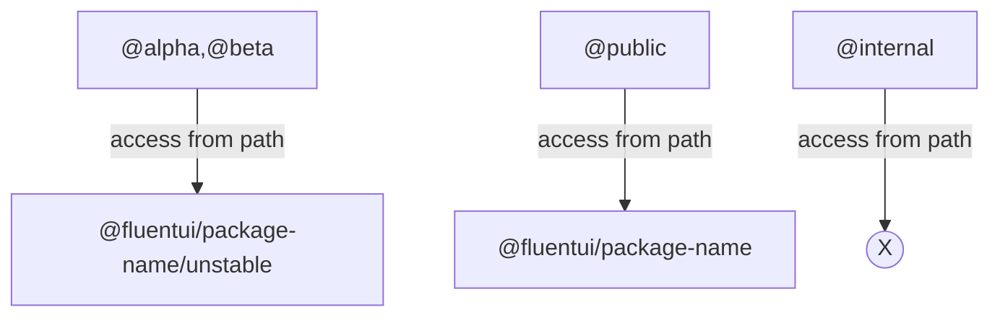

# RFC: Package public API accessors

---

_@hotell_

## Summary

We want to control which parts of API surface of our packages are being exposed to public.

## Background

During v9 pre-release phase we ran into various situation where we didn't want to propagate APIs as ready to go, thus we established `_unstable` identifiers naming suffix to mark those as unstable. To complement this approach we also introduced `*/unstable` deep imports for API's that are not STABLE. This works to some extent but fails short as it's a manual work that is not checked by automation. This led to scenarios that we unintentionally exposed INTERNAL apis to public which led to breaking changes which we want to avoid at all costs as we follow proper semver.

## Problem statement

We expose all APIs of our packages as a PUBLIC from barrel files (`src/index.ts`) to consumers, which introduces problems as we can expose apis that were supposed to be used only internally within our repo or only be available in particular pre-release stage (ALPHA/BETA versions).

## Detailed Design or Proposal

We want to provide style guide/common approach how to annotate package APIs with proper ACCESS modifiers which will be processed/verified by tooling automation.

Note that our approach will be applied only on **Type Declaration emit level** as we consider TypeScript surface as only source of truth for our package APIs.

> This means that if users use only vanilla JavaScript nothing will stop them from using those API's - as we don't support that kind of usage users take the risk that things may/will break for them unfortunately and also they will not get any support from our side.

### Proposed access modifiers:

#### `@internal`

It indicates that an API item is meant only for usage by other NPM packages from the same repo. Third parties _should never use “internal” APIs._

- tooling will trim the declaration from a public API surface.
- tooling will trim the declaration from `/unstable` API surface.

**Example:**

```ts
// @filename package-a/src/index.ts

/**
 *
 * @internal
 */
export function doSomething(): void {}

export function hello(): void {}
```

↓↓ transforms to ↓↓

```ts
// @filename package-a/dist/index.d.ts

export declare function hello(): void;
```

#### `@alpha`

It indicates that an API item is eventually intended to be public, but currently is in an early stage of development

- tooling will trim the declaration from a public API surface.
- can be exposed only from `/unstable` API surface
- tolling will NOT TRIM the declaration from `/unstable` API surface.

**Example:**

- unstable api

```ts
// @filename package-a/src/unstable/index.ts

/**
 *
 * @alpha
 */
export function doSomething(): void {}

export function hello(): void {}
```

↓↓ transforms to ↓↓

```ts
// @filename package-a/dist/unstable.d.ts
export function doSomething(): void;
export declare function hello(): void;
```

- stable api

```ts
// @filename package-a/src/index.ts

// 🚨🚨🚨 NOTE THAT THIS IS PROBABLY A MISTAKE BUT TOOLING WILL COVER YOU
/**
 *
 * @alpha
 */
export function doSomething(): void {}
/**
 *
 * @public
 */
export function hello(): void {}
```

↓↓ transforms to ↓↓

```ts
// @filename package-a/dist/index.d.ts
export declare function hello(): void;
```

#### `@beta`

It indicates that an API item has been released as a preview or for experimental purposes. Third parties are encouraged to try it and provide feedback. However, a “beta” API should NOT be used in production, because it may be changed or removed in a future version.

- tooling will trim the declaration from a public API surface.
- can be exposed only from `/unstable` API surface
- tooling will NOT TRIM the declaration from `/unstable` API surface.

**Example:**

- unstable api

```ts
// @filename package-a/src/unstable/index.ts

/**
 *
 * @beta
 */
export function doSomething(): void {}

export function hello(): void {}
```

↓↓ transforms to ↓↓

```ts
// @filename package-a/dist/unstable.d.ts
export function doSomething(): void;
export declare function hello(): void;
```

- stable api

```ts
// @filename package-a/src/index.ts

// 🚨🚨🚨 NOTE THAT THIS IS PROBABLY A MISTAKE BUT TOOLING WILL COVER YOU
/**
 *
 * @beta
 */
export function doSomething(): void {}
/**
 *
 * @public
 */
export function hello(): void {}
```

↓↓ transforms to ↓↓

```ts
// @filename package-a/dist/index.d.ts
export declare function hello(): void;
```

#### `@public`

It indicates that an API item has been officially released, and is now part of the supported contract for a package. Semver versioning is used and enforced thus the API signature cannot be changed without a MAJOR version increment.

- tooling will NOT trim the declaration from a public API surface.
- CANNOT be exposed from `/unstable` API surface

**Example:**

```ts
// @filename package-a/src/index.ts

/**
 *
 * @internal
 */
export function doSomething(): void {}
/**
 *
 * @public
 */
export function hello(): void {}
```

↓↓ transforms to ↓↓

```ts
// @filename package-a/dist/index.d.ts
export declare function hello(): void;
```

### Summary

Access modifiers introduced in this document will create following package API patterns:



- enforce us to not expose public/beta/internal by accident as part of public API
- guard us from exposing public/beta shipped from package `/unstable` api to be shipped in consuming package as `stable` API

### Future work:

To follow all release stage types we should support also `@rc` annotation for "release candidate".

Even better, to simplify differentiation between `stable` and `unstable` we would like to introduce `@unstable` annotation that would replace `@alpha`/`@beta`/`@rc` as from API access perspective there isn't any native JS tooling yet that would notify all consumers that they are using alpha/beta/rc APIs. For that reason we will go with `unstable` subpath and `@unstable` annotation for better tooling automation within our codebase.

### Open questions:

- should we keep `_unstable` suffix for identifiers ?
  - yes
- should we prefix `@internal` apis with `_` ? (problematic with react hooks)
  - not at this time. we might bring this up in the future with potential suffix which would work for react hooks as well.

### Pros and Cons

<!-- Enumerate the pros and cons of the proposal. Make sure to think about and be clear on the cons or drawbacks of this propsoal. If there are multiple proposals include this for each. -->

**Pros:**

- explicit API exposure to users
- enforced API surface by tooling
- no unintended API leaks to users
- existing tooling that enables this behaviors to some extent (api-extractor)

**Cons:**

- worse local DX: need to `generate api` for all package dependencies within repo to be able to generate api report and catch api issues
- no existing tooling that "just works" for all use-cases
- api-extractor has various issues thus we need to change our build workflow a bit
  - https://github.com/microsoft/rushstack/issues/3445
  - https://github.com/microsoft/rushstack/issues/3444
  - https://github.com/microsoft/rushstack/issues/3443

## Discarded Solutions

<!-- As you enumerate possible solutions, try to keep track of the discarded ones. This should include why we discarded the solution. -->

## Open Issues

<!-- Optional section, but useful for first drafts. Use this section to track open issues on unanswered questions regarding the design or proposal.  -->

- https://github.com/microsoft/fluentui/issues/23343
- https://github.com/microsoft/fluentui/pull/23335

### Tolling issues:

- https://github.com/microsoft/rushstack/issues/3558
- https://github.com/microsoft/rushstack/issues/3445
- https://github.com/microsoft/rushstack/issues/3444
- https://github.com/microsoft/rushstack/issues/3443
