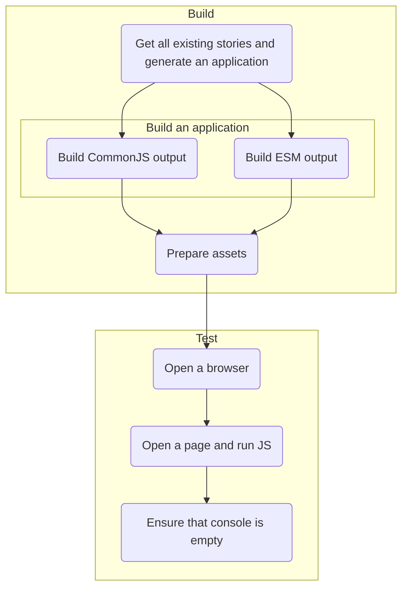

# RFC: SSR testing for `@fluentui/react-components`

[@layershifter](https://github.com/layershifter)

## Summary

We want to ensure that our existing and new components are compatible with Server-side rendering (SSR). The best way to ensure that it works properly is to automate it.

## Background

There are common issues related to SSR:

- components throw because they access restricted globals during rendering, for example `window.getComputedStyle()`
- components generate different DOM in Node & browser environments that breaks hydration process ("Warning: Text content did not match")

## Problem statement

We don't test our components now. It's time to test them.

## Detailed Design or Proposal

We want to have the fast way to ensure that our components don't have the issues mentioned before. The best way is to reuse existing stories for components as they should represent all existing permutations of components' states.

The proposal is to implement a new application that will perform tests. We could use Next.js or other framework to perform rendering, but it's too heavy for our tests.



### Get all existing stories and generate an application

We have the source of truth in `packages/react-components/.storybook/main.utils`, there is a function `getVnextStories` that returns globs to find files with stories.

<details>
  <summary>`getStories.js`</summary>

```js
const { getVnextStories } = require('./packages/react-components/.storybook/main.utils');

const stories = getVnextStories()
  .map(g => {
    return glob.sync(g, {
      cwd: path.resolve(__dirname, 'packages/react-components/.storybook'),
    });
  })
  .flatMap(i => i)
  .map(f => path.resolve(__dirname, 'packages/react-components/.storybook', f))
  .filter(f => fs.readFileSync(f, 'utf8').includes('export { Default } from'))
  .map(f =>
    fs
      .readFileSync(f, 'utf8')
      .split('\n')
      .filter(l => l.includes('export {'))
      .map(l =>
        l
          .replace('export {', 'import {')
          .replace(/\'(.\/)(.+)\';/g, (...a) => {
            const importName = a[2];
            return `"./${path.relative(__dirname, path.dirname(f))}/${importName}";`;
          })
          .replace(/import { (.+) }/g, (...a) => {
            const base = path.basename(f).split('.')[0];
            return `import { ${a[1]} as ${base}${a[1]} }`;
          }),
      ),
  )
  .flatMap(f => f);
```

</details>

> **Notes**:
>
> - For the final implementation it probably will use AST instead of regular expressions
> - There is no sense to use Storybook API as we have strict structure for stories (a single story per a file)

This ugly snippet generates following:

```ts
import { Default as DividerDefault } from './packages/react-divider/src/stories/DividerDefault.stories';
import { Vertical as DividerVertical } from './packages/react-divider/src/stories/DividerVertical.stories';
// etc.
```

With additional tweaks we can generate the following `App` component:

```tsx
// stories.tsx
import { Truncate as TextTruncate } from './packages/react-text/src/stories/TextTruncate.stories';
import { Font as TextFont } from './packages/react-text/src/stories/TextFont.stories';

export const Stories = () => (
  <SSRProvider>
    <FluentProvider theme={teamsLightTheme}>
      <TextTruncate />
      <TextFont />
      {/* etc. */}
    </FluentProvider>
  </SSRProvider>
);
```

This is enough good to get all stories, be able to bundle and then render them.

### Build an application

We will need to get both CommonJS & ESM bundles:

- CommonJS is needed to avoid evaluation with `ts-node` or `babel-register`
- ESM will be used directly in a browser

The proposal is to use esbuild as it's blazing fast and perfectly matches this use case.

<details>
  <summary>`build.js`</summary>

```ts
await esbuild.build({
  entryPoints: ['stories.tsx'],
  bundle: true,
  jsx: 'transform',
  format: 'cjs',
  target: 'node14',
  // React & dependencies are not bundled intentionally to avoid collisions when they will be required
  external: ['react', 'scheduler', 'react-dom', '@griffel/react', '@griffel/core'],
  outfile: './dist/out-node.js',
  plugins: [TsconfigPathsPlugin({ tsconfig: path.resolve(__dirname, 'tsconfig.base.json') })],
});
await esbuild.build({
  // ESM has different entrypoint as we need to call "ReactDOM.hydrate()" there
  entryPoints: ['app.tsx'],
  bundle: true,
  jsx: 'transform',
  format: 'iife',
  target: 'chrome101',
  outfile: './dist/out-browser.js',
  plugins: [TsconfigPathsPlugin({ tsconfig: path.resolve(__dirname, 'tsconfig.base.json') })],
});
```

</details>

**Note:** ESBuild will use existing path aliases to resolve packages used in stories.

### Prepare assets

On this stage we effectively need to create `index.html` that will be used for browser testing.

We will use APIs for React 16.8/17 as we don't support React 18 yet. Once we will get React 18 in our repo it's reasonable to switch to streaming rendering. The snippet below renders all components and styles for them to static markup and saves as `index.html`.

<details>
  <summary>`render.js`</summary>

```js
const App = require('./out-node').App;
const renderer = createDOMRenderer();

const resultDOM = ReactDOM.renderToString(
  React.createElement(RendererProvider, { renderer }, React.createElement(App)),
);
const resultStyles = ReactDOM.renderToStaticMarkup(renderToStyleElements(renderer));

await fs.promises.writeFile(
  './index.html',
  `
  <html>
    <head>${resultStyles}</head>
    <body>
      <div id="root">${resultDOM}</div>
      <script src="./out-browser.js"></script>
    </body>
  </html>
  
  `,
);
```

</details>

### Test

This stage performs actual testing.

- Start Chrome (via `puppeteer`)
  - **Note**: the latest version of Puppeteer will be used to get latest Chrome. Existing version in our repo does not support even `:focus-visible` (that creates false positive errors)
- Open a page (`index.html` file)
  - **Note**: Webserver will not be used, a file will be opened via `file://`
  - A page will have configured interceptors to avoid loading resources (images) from CDN
- Ensure that there are no errors, otherwise test fails
  - **Note**: For this reason the test app will run with `process.NODE_ENV = 'development'`
  - **Note**: _Probably_ there is sense to restrict the test to catch only SSR related errors (in prototype it fails also on missing React keys, for example)

## Summary

- This test is not reusable and will be implemented only for `@fluentui/react-components`
  - `@fluentui/react` & `@fluentui/react-northstar` has own tests
- Taking into account the speed, there are reasons to make it scoped
  - The new package will have `@fluentui/react-components` to trigger the test based on dependencies

## Pros and Cons

- 👍 It's fast (3 seconds to run the whole test)
- 👍 We will reuse existing stories
- 👎 Some code to maintain

## Discarded Solutions

- Use Next.js. Running Next.js and building bundles will take longer than running the whole test. It will also a lot of deps to our `node_modules`.

## Open Issues

<!-- Optional section, but useful for first drafts. Use this section to track open issues on unanswered questions regarding the design or proposal.  -->
