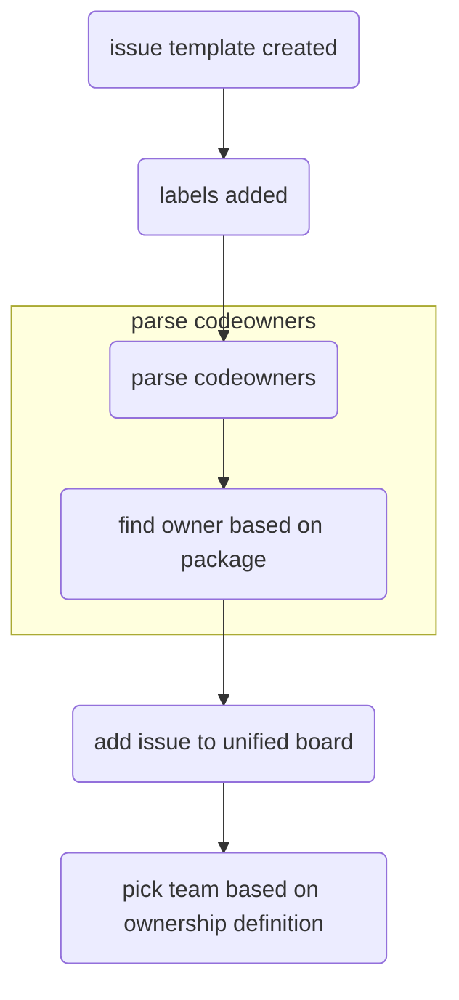

# RFC: Triage automation (Shield)

<!--
An RFC can be anything. A question, a suggestion, a plan. The purpose of this template is to give some structure to help folks write successful RFCs. However, don't feel constrained by this template; use your best judgement.

Tips for writing a successful RFC:

- Simple plain words that make your point, fancy words obfuscate
- Try to stay concise, but don't gloss over important details
- Try to write a neutral problem statement, not one that motivates your desired solution
- Remember, "Writing is thinking". It's natural to realize new ideas while writing your proposal
-->

_contributors:_ _@hotell_

---

## Summary

We wanna make initial triage-ing issues a fully automated process.

## Problem statement

At the moment processing newly created issues is mostly manual work done by 2 people on shield duty. While this was a good start it wont scale as the codebase/team/contributors list grows. Thus we need to introduce automation to establish best possible contributors DX while they need our help.

<!--
Why are we making this change? What problem are we solving? What do we expect to gain from this?

This section is important as the motivation or problem statement is indepenent from the proposed change. Even if this RFC is not accepted this Motivation can be used for alternative solutions.

In the end, please make sure to present a neutral Problem statement, rather than one that motivates a particular solution
-->

## Detailed Design or Proposal

<!-- This is the bulk of the RFC. Explain the proposal or design in enough detail for the inteded audience to understand. -->

After we [introduced new github issues beta](https://github.com/microsoft/fluentui/pull/22337) for reporting issues and feature request, the experience for both contributors and shield devs was significantly improved. A followup that was discussed is to implement further automation by leveraging Github Actions, This document will describe the approach in better detail.

We would like to automate following steps:

1. project label assignment
2. package label assignment
3. assign issue to project board/team

**Pre-requirements:**

- normalization/unification of labels within monorepo for projects

_Current state:_

- 2 labels for v0
  - https://github.com/microsoft/fluentui/labels?q=northstar
- 2 labels for v9
  - https://github.com/microsoft/fluentui/labels/Fluent%20UI%20react-components%20%28v9%29
  - https://github.com/microsoft/fluentui/labels/Fluent%20UI%20vNext
- per component labels
  - same labels mixed for various fluent version https://github.com/microsoft/fluentui/labels/Component%3A%20Dialog

_Expected state:_

- 1 label for v0
- 1 label for v9
- label per published package
- "component labels" can stay as are but should be used solely for v8 (internal react package "sub-packages" https://github.com/microsoft/fluentui/labels/Component%3A%20Dialog)

### 1. project label assignment

> Note:
>
> - by "project" we mean one of libraries that exist within monorepo (v0,v8,v9,web-components)

**Workflow:**

Based on selected project within issue template, we should add appropriate label.


> NOTE:
>
> - this is already implement via [github action](https://github.com/microsoft/fluentui/pull/24911)

### 2. package label assignment

> Note:
>
> - by "package" we mean official package name used to publish to npm registry without `@scope` prefix
> - by "Component name" we mean official package name transformed via following `toPascalCase(packageName.replace('@fluentui/react-'))`

**Workflow:**

Based on selected project within issue template, additional select should be dynamically generated so contributor can pick proper package.


Unfortunately **[dynamic input controls are not possible with github issues beta](https://github.com/community/community/discussions/29067)** which leaves us with following options how to implement this:

1. use only package names or Component name in "Library" picker

- cons
  - huge list because we have quite a lot packages
- pros
  - only 1 issue/feature template that we need to maintain
  - removes need of `1. project label assignment` as labeling would be handled in one step

2. creating feature/bug templates per library

- cons
  - 2 (feature/bug) x N templates (N is number of libraries in monorepo)
- pros
  - clear separation that can be tweaked to particular library needs if needed

3. creating completely custom issue form solution (example [vuejs](https://github.com/vuejs/vue/issues/new/choose))

- cons
  - big effort in terms of development and maintenance
- pros
  - complete control about issue reporting
  - another possible dog food for v9 controls

**Workflow approach - summary:**

After feedback and additional discussion the majority is in favor of "2. creating feature/bug templates per library", where the select list will contain "Component names".

Simplified example of select box option for project issue template:

```
Component:
 - Text
 - Menu
 - Dialog
 - ...
```

Based on this, all project labels should adhere to unified pattern based on issue origin(project):

1. issue origin: v9 template:

```
Text -> package: react-text, Fluent UI react-components (v9)
Menu -> package: react-menu, Fluent UI react-components (v9)
Dialog -> package: react-dialog, Fluent UI react-components (v9)
```

2. issue origin: v8 template:

```
Text -> package: react, Fluent UI react (v8)
Menu -> package: react, Fluent UI react (v8)
Dialog -> package: react, Fluent UI react (v8)
Chart -> package: react-charting, Fluent UI react (v8)
```

3. issue origin: v0 template:

```
Text -> package: react-northstar, Fluent UI react-northstar (v0)
Menu -> package: react-northstar, Fluent UI react-northstar (v0)
Dialog -> package: react-northstar, Fluent UI react-northstar (v0)
```

4. issue origin: web-components template:

```
Text -> package: web-components
Menu -> package: web-components
```

**Q&A:**

**1. How will we maintain list of packages in issue template:**

On library creation/removal we will tweak our issue/feature template automatically.

> Note:
>
> - this can also happen only after created package has been published to npm registry ( post release GH action)

### 3. assign issue to project board/team

Based on assigned labels, we can automate assignment of issues based on our source of truth of ownership which is `CODEOWNERS` file.

> 💡 NOTE:
>
> - every issue will still contain "Triage needed" flag, so it can be verified by person on shield duty

**Workflow:**



## Pros and Cons

**Cons:**

- some amount of maintenance

**Pros:**

- improved issues reporting experience
- improved post-triaging experience and prioritization
- no need for:
  - human interaction for initial triaging
  - manual communication that can "get lost" and can take extra time (time-zone constraints)
  - extra number of humans needed on Shield

## Discarded Solutions

<!-- As you enumerate possible solutions, try to keep track of the discarded ones. This should include why we discarded the solution. -->

NONE

## Open Issues

Not applicable

<!-- Optional section, but useful for first drafts. Use this section to track open issues on unanswered questions regarding the design or proposal.  -->
