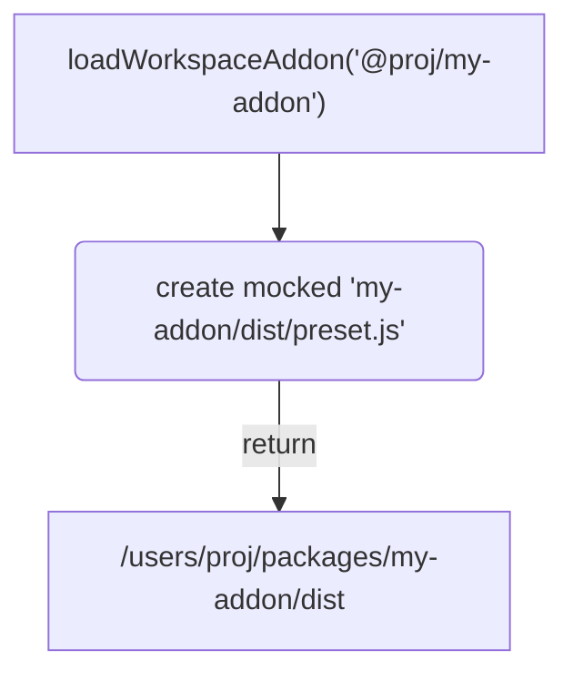
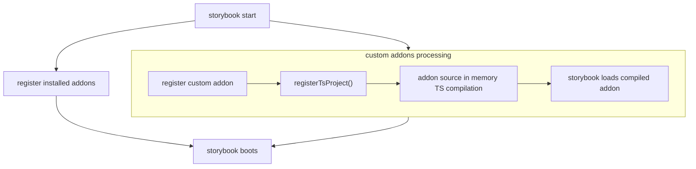

# Storybook utils

This module contains solely v9 packages storybook tools.

> **💡 NOTE:** only exception is `webpack.config.js` that is used for v8

# API

## `loadWorkspaceAddon`

Function that registers custom workspace(monorepo) storybook addon written in TypeScript without need to build first before use.

### Usage

```js
// @filename .storybook/main.js

const { loadWorkspaceAddon } = require('@fluentui/scripts/storybook');

module.exports = {
  addons: [
    // 3rd party packages/addons
    '@storybook/addon-essentials',
    '@storybook/addon-a11y',

    // workspace custom addon
    loadWorkspaceAddon('@fluentui/custom-storybook-addon'),
  ],
};
```

### How does it work

Before going into details we need to understand how storybook registers addons.

#### Addons registration

Addons are registered via `addon` property that needs to contain following:

- npm published package name (ex : `'my-react-addon'`,`'@org/some-addon'`)
- absolute path to folder which contains `preset.js` js module

#### Addons boilerplate

Custom addon needs to contain `preset.js` at its package root, which contains registration logic for manager and preset (API defined by storybook).

**file structure:**

```sh
|- custom-addon/
  |- preset.js
  |- package.json
```

**preset.js:**

```js
function config(entry = []) {
  return [
    ...entry,
    require.resolve('./lib/preset/preview'), // (A)
  ];
}

function managerEntries(entry = []) {
  return [
    ...entry,
    require.resolve('./lib/preset/manager'), // (B)
  ];
}

module.exports = { managerEntries, config };
```

Beside standard boilerplate the important part is (line A,B) the relative path, which points to compiled assets instead of source code (written in TypeScript), which implies that we will **need to build our addon source and all its dependencies prior usage**. This is something that we wanna avoid.

#### build-less addon registration

To enable build-less(in-memory compilation) of custom workspace addon we need to do following:

**1. create mock of `preset.js` on the file system which will point to source instead of build assets**

```diff
function config(entry = []) {
  return [
    ...entry,
-    require.resolve('./lib/preset/preview'),
+    require.resolve('./src/preset/preview'),
  ];
}

function managerEntries(entry = []) {
  return [
    ...entry,
-    require.resolve('./lib/preset/manager'),
+    require.resolve('./src/preset/manager'),
  ];
}
```

This mocked file is created at location specified by `tsconfig.lib.json` `outDir`

**2. override `require` NodeJS loader**

- to understand our workspace (path aliases in tsconfig.base.json)

  - This is mandatory if another workspace packages are used in addon implementation. It is done via `tsconfig-path` `register` function

- so it can load TypeScript (via on of `@swc-node/register`, `@ts-node/register`, `@babel/register`)
  - This is done via `@swc-node/register`

Whole solution of 2. is abstracted in [`registerTsProject` function from `nx` package](https://github.com/nrwl/nx/blob/master/packages/nx/src/utils/register.ts#L14).

The actual registration code is pre-pended to mocked `preset.js` file.

**3. return absolute path to directory which contains mocked `preset.js`**

instead of registering custom addon by its package name, we need to return absolute path which points to directory in which mocked `preset.js` will be created

##### Summary can be seen at following graphs:




