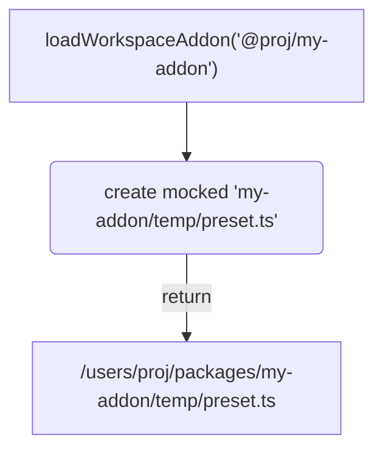
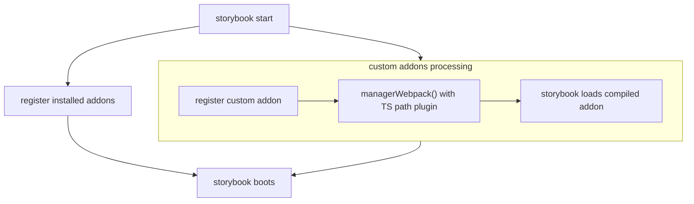
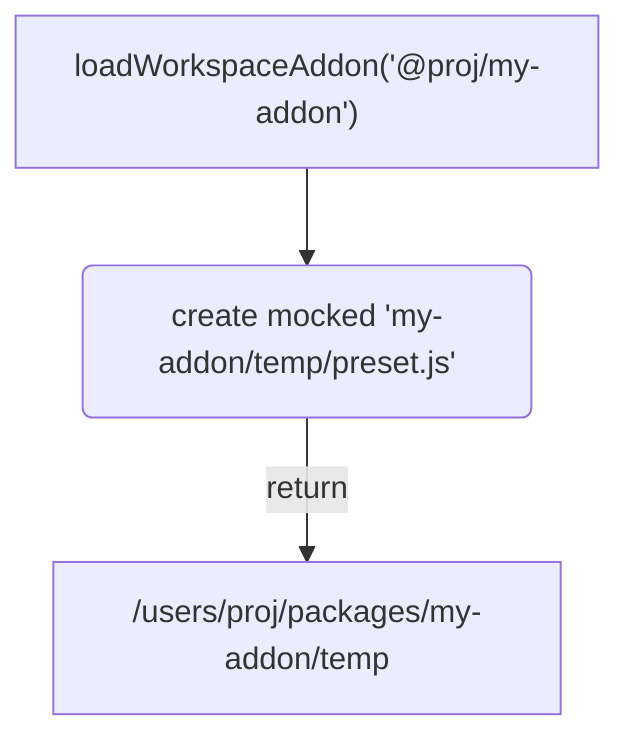
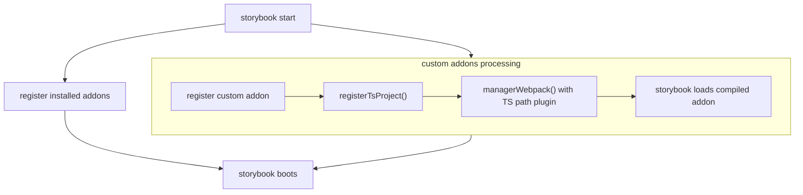

# Storybook

Utils for storybook.

> **NOTE:** This module contains solely v9 packages storybook tools.

# API

## `loadWorkspaceAddon`

Function that registers custom workspace(monorepo) storybook addon written in TypeScript without need to "build first" before use.

### Usage

```js
// @filename .storybook/main.js

const { loadWorkspaceAddon } = require('@fluentui/scripts/storybook');

const tsConfigPath = path.join(workspaceRoot, 'tsconfig.base.json');

module.exports = {
  addons: [
    // 3rd party packages/addons
    '@storybook/addon-essentials',
    '@storybook/addon-a11y',

    // workspace custom addon
    loadWorkspaceAddon('@fluentui/custom-storybook-addon', { tsConfigPath }),
  ],
};
```

### How does it work

Before going into details we need to understand how storybook registers addons.

#### Addons registration

Addons are registered via `addon` property that needs to contain one of following:

- npm published package name (ex : `'my-react-addon'`,`'@org/some-addon'`)
- absolute path to folder which contains `preset.js` js module
- absolute path to `preset` registration module (eg `/User/foo/bar/package/preset.js`)

#### Addons boilerplate

Custom addon needs to contain `preset.js` at its package root, which contains registration logic for manager and preset (API defined by storybook).

**file structure:**

```sh
|- custom-addon/
  |- preset.js
  |- package.json
```

**preset.js:**

```js
function config(entry = []) {
  return [
    ...entry,
    require.resolve('./lib/preset/preview'), // (A)
  ];
}

function managerEntries(entry = []) {
  return [
    ...entry,
    require.resolve('./lib/preset/manager'), // (B)
  ];
}

module.exports = { managerEntries, config };
```

Beside standard boilerplate the important part is (line A,B) the relative path, which points to compiled assets instead of source code (written in TypeScript), which implies that we will **need to build our addon source and all its dependencies prior usage**.

This is something that we wanna avoid.

#### build-less addon registration

To enable build-less(in-memory compilation) for custom workspace addon we have 2 options how to proceed:

##### Option 1

> **NOTE:** our implementation uses THIS OPTION

**1. create mock of `preset.ts` on the file system which will point to source instead of build assets**

> This mocked file is will live within `temp` folder (which is ignored from git).

```diff
function config(entry = []) {
  return [
    ...entry,
-    require.resolve('./lib/preset/preview'),
+    require.resolve('./src/preset/preview.ts'),
  ];
}

function managerEntries(entry = []) {
  return [
    ...entry,
-    require.resolve('./lib/preset/manager'),
+    require.resolve('./src/preset/manager.ts'),
  ];
}
```

**2. re-use Storybook Webpack processing**

- define `managerWebpack` which will register `TsconfigPathsPlugin` that will be able to resolve absolute paths to other workspace packages. (A)
- register `managerWebpack` as part of addon preset API (B)

```diff
+ const { registerTsPaths } = require('@fluentui/scripts-storybook');

function config(entry = []) {
  return [
    ...entry,
    require.resolve('./src/preset/preview.ts'),
  ];
}

function managerEntries(entry = []) {
  return [
    ...entry,
    require.resolve('./src/preset/manager.ts'),
  ];
}

+ function managerWebpack(config, options) { (A)
+   registerTsPaths({config, tsConfigPath: '/Users/martinhochel/Projects/msft/fluentui/tsconfig.base.json'});
+ return config;
+ }

- module.exports = { managerEntries, config };
+ module.exports = { managerWebpack, managerEntries, config }; (B)
```

**3. return absolute path to TypeScript mocked which contains mocked `preset.js`**

instead of registering custom addon by its package name, we need to return absolute path which points to mocked `preset.ts`. This will turn on TS resolution mechanism that are defined within storybook thus we don't need to register manually any node TS files module resolutions.

##### Summary Option 1:





##### Option 2

**1. create mock of `preset.js` on the file system which will point to source instead of build assets**

> This mocked file is will live within `temp` folder (which is ignored from git).

```diff
function config(entry = []) {
  return [
    ...entry,
-    require.resolve('./lib/preset/preview'),
+    require.resolve('./src/preset/preview'),
  ];
}

function managerEntries(entry = []) {
  return [
    ...entry,
-    require.resolve('./lib/preset/manager'),
+    require.resolve('./src/preset/manager'),
  ];
}
```

**2. modify `require` NodeJS/Webpack resolution**

- so it will properly load TypeScript sources referenced from mocked `preset.js` (via on of `@swc-node/register`, `@ts-node/register`, `@babel/register`). (A)

  - This is can be done `@swc-node/register` (abstracted by [`registerTsProject` function from `nx` package](https://github.com/nrwl/nx/blob/master/packages/nx/src/utils/register.ts#L14))

- to understand our workspace (path aliases in tsconfig.base.json) by registering `TsconfigPathsPlugin` within `managerWebpack` hook. (B)

  - This is mandatory if another workspace packages are used within addon implementation.

- register `managerWebpack` as part of addon preset API (C)

```diff
+ const { registerTsPaths } = require('@fluentui/scripts-storybook');
+ const { registerTsProject } = require('@nx/js/src/internal');

+ registerTsProject('/Users/martinhochel/Projects/msft/fluentui/tsconfig.base.json') (A)

function config(entry = []) {
  return [
    ...entry,
    require.resolve('./src/preset/preview'),
  ];
}

function managerEntries(entry = []) {
  return [
    ...entry,
    require.resolve('./src/preset/manager'),
  ];
}

+ function managerWebpack(config, options) { (B)
+   registerTsPaths({config, tsConfigPath: '/Users/martinhochel/Projects/msft/fluentui/tsconfig.base.json'});
+ return config;
+ }

- module.exports = { managerEntries, config };
+ module.exports = { managerWebpack, managerEntries, config }; (C)
```

**3. return absolute path to directory which contains mocked `preset.js`**

instead of registering custom addon by its package name, we need to return absolute path which points to directory in which mocked `preset.js` will be created

##### Summary Option 2:




