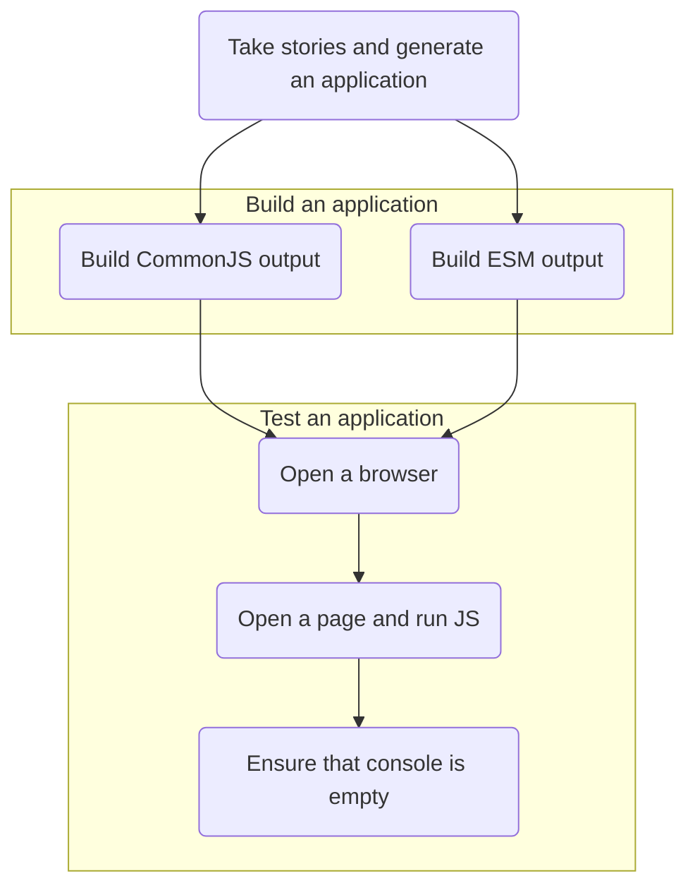

## Test SSR utility

## Usage

```shell
# test-ssr "./stories/**/*.stories.tsx"
```

The utility produces assets for testing, this includes:

- CommonJS output user for server rendering
- ES Modules output used for serving in a browser
- `index.html` with generated markup (simulates server's behavior)

Assets are stored in `node_modules/.cache/ssr-tests` folder and generated based on stories passed. Assets are served in a real browser to ensure that there are no errors in console related to SSR.



#### Debugging

All assets are available in `node_modules/.cache/ssr-tests` folder. You can open `./node_modules/.cache/ssr-tests/index.html` in any browser and debug relevant issues.
