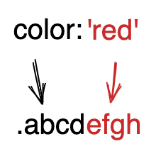

# makeStyles RFC

## Background

`makeStyles` is a way how CSS is applied to core components and their variants as well as a utility used to implement style overrides for those components.

## Prior Art

This section summarises previous approaches and their pros and cons.

### v0 approach

`@fluentui/react-northstar` (aka v0 aka Stardust) uses CSS-in-JS. [Fela](https://github.com/robinweser/fela) CSS-in-JS library is used.

#### Fela uses atomic CSS classes

- one CSS property = one CSS class
- all selectors have one class specificity
- the same classes are reused anywhere in the application = smaller DOM

#### CSS classes are added to DOM when used for the first time

- only the classes that are used are added to DOM
- that means those are added in non-deterministic order

#### Two CSS classes setting the same property cannot be applied to the same element

If there are two classes setting the same CSS property (`.r {color: red}` and `.b {color: blue}`) those can never be applied to the same element.
As both classes have the same one class specificity, the rule defined later in the DOM will win. As the insertion order is non-deterministic, the resulting style would be non-deterministic as well.
As a consequence, there is a couple of restrictions:

- Shorthand css properties (`margin`) must be expanded before merging (to `margin-top`, `margin-right`, `margin-bottom`, `margin-left`).
- To apply any overrides, it is not possible to just concatenate classes. Style object are deeply nested as they can contain styles for pseudo elements (`::before`), pseudo classes (`:hover`) or nested elements (`& .indicator`). Therefore style objects must be always deep merged and then the classes can be computed.
- Due to the previous point, when parent component is passing style overrides to a child component it needs to know what kind of component the child is.
  If that is a non-FUI component, parent must pass the overrides as a list of classnames. If the child is a FUI component, the overrides must me passes as `styles` object so that the child can merge the styles correctly.
  This can be complicated as there are scenarios where the parent does not know what child is will render (especially when the styles are not applied by the direct child but somewhere else down the tree).
- When overrides are passed from parent to child, the whole styles must be re-evaluated in runtime every time. Child can cache evaluated styles and classnames based on (limited) set of input props and state. And FUI components do that. But once style overrides are passed to the componentm the overrides (`styles` or `variables`) and component styles object must be deep merged.

#### Application overrides are part of the theme object

All application-owned style overrides are part of the Theme object. Most of those are just one-off overrides.
This results in a huge object (several files and thousands of lines per component) which is not tree-shakeable.
There is also unnecessary and confusing indirection when defining overrides and no support for dead code elimination.
Overrides are defined far away from their usage, see the example bellow.

```jsx
// App
<Provider theme={mergeThemes(theme.light, lightOverrides)}>
  <App />
</Provider>

// Component usage - I need to go to a completely different file to find out what styles the variable overrides.
<Button variables={{isMuteButton: true}} />

// Theme overrides
const lightOverrides = {
  componentStyles: {
    Button: {
      root: ({variables}) => ({
        // hundreds of overrides
        ...(variables.isMuteButton && {
          minWidth: '64px',
        }),
        // another hundreds of overrides
      })
    }
    // all other components
  }
}

const darkOverrides = {
  // can have separate overrides for isMuteButton variable.
}
```

#### Specificity is controlled by JS

This is the biggest benefit of CSS-in-JS approach, whatever is applied last in JS code always wins the CSS specificity war. As the library is used by developers and JS is their primary language (not CSS) this is expected and intuitive behavior.

### `useCSS` in v0

One of the biggest pain points in v0 are the overrides. `useCSS` tries to solve that.
Basic components still use Fela with atomic CSS classes and 1 class specificity. `useCSS` is used for overrides and always generates classes with 2 classes specificity. Also, instead of using atomic CSS, monolithic classes are used for overrides (Emotion CSS-in-JS is used for that).

#### No special prop for passing overrides to children

For handling multiple levels of overrides, instead of using a special prop with all its problems (see above), `useCSS` just returns a class which can be passed to a child using `className`. If there is another `useCSS` call in the child, it takes the `className` from parent.

1. `useCSS` call in parent generates a classname, and adds mapping from the classname to a style object to a global dictionary.
2. Parent takes the class returned by the `useCSS` call and passes it to its child.
3. The child calls `useCSS` to apply its own overrides and also passes it the class from parent.
4. `useCSS` finds the style object in the dictionary, merges the original style object with the child's style overrides and returns the new classname. Instead of performing an expensive object deep merge, it just concatenates the two stringified style objects and depends on the-latest-wins CSS rule.


#### Limitations

This approach looks good for style overrides, we are not sure this approach works the best for core component styles. Without that, we would have two different styling approaches in place.
Although the string concatenation is performant, it results in a lot of CSS code.

### v8 `makeStyles`

In order to improve rendering performance, v8 approach is closer to static CSS.

There are two main functions in this approach `makeStyles` and `useStyles`.
`makeStyles` is a factory which takes style object as input and returns a `useStyles` hook. `makeStyles` does not accept any theme or React context and should be called in a module scope, not in a scope of a React component.
When rendering a component, `useStyles` hook is called passing a theme to it. The `useStyles` function injects the styles into DOM (if not done yet) and maps props to classnames.

#### Multiple classes are applied to a single element

As in static CSS approach, multiple semantic classes are applied to an element.
For example `<Button primary disabled>` renders as `<button class="primary disabled">`.
To style the component, combined classes are used in CSS as well:

```css
.primary {
}
.disabled {
}
.primary.disabled {
}
```

This is causing problems with overrides - assuming it is guaranteed that override classes are written bellow the component styles in the DOM, for most cases in this example, it is enough to have 1 class specificity for overrides to work correctly. The only case where the 1 class override does not work is for CSS properties in `.disabled.button`.
Consumer does not know what specificity must be used for the overrides, this can also change between library versions. Also different engineers can beak each other's styling.

#### Stylesheet is generated build time

There is a build time step which generates stylesheet.
In runtime only the classes are applied based on props and state.

#### Styles precedence is set by module evaluation order

The order of `makeStyles` calls defines the DOM insertion order. When `makeStyles` is called, it does NOT insert the CSS to DOM, but assigns a counter-based id to the associated styles. When `useStyles` returned by the `makeStyles` is called for the first time, it inserts the CSS to DOM in the order defined by the `makeStyles` call.

For that to work as expected, you cannot export `makeStyles` to share styles in multiple different modules - that would lead to non-deterministic insertion order. The only way to share styles is to export the style object and have a dedicated `makeStyles` calls in all the modules which reuse the style object.

The approach also currently does not support async API (`React.Suspense`) as there the modules evaluation order is non-deterministic. (Code example: https://codesandbox.io/s/kind-davinci-xvwxg)

#### Inspired by Material UI

The approach is inspired by Material UI
There is a build step which generates a stylesheet for every `makeStyles` call.

## Converged solution

Can we use v8 `makeStyles` (build time style evaluation) but let JS handle the "specificity"?

The expensive part in v0 styling approach is the style evaluation - processing styles, expanding CSS shorthands, vendor prefixing, RTL, generating classnames. But we can do most of this build time.

### Basic algorithm

As an input, there is a style object:

```js
const source = {
  color: 'red',
  margin: '0 10px 0 0',
  ':hover': {
    background: 'green',
  },
};
```

In build time, this object can be processed (CSS expand, RTL...) and atomic CSS generated for each CSS property:

```js
// ⚠️ This is proposed and simplified example output for the purpose of the spec, not the real build output ⚠️
const buildOutput = {
  color: { classname: 'abcd', css: '.abcd{color:red}' },
  marginTop: { classname: 'efgh', css: '.efgh{margin-top:0}' }, // CSS expand
  marginRight: { classname: 'ijkl', css: '.ijkl{margin-right:10px}', rtlCss: '.rijkl{margin-left:10px}' }, // expand, RTL
  // ...
  ':hover+background': { classname: 'mnop', css: '.mnop:hover{background:green}' },
};
```

This object uses CSS property names as keys, builds "compound" string keys for nested objects to flatten the output. With that approach, it should be quite cheap to apply overrides. It is not necessary to read the object values, we just need to shallow apply (merge) the override object on top of the base object. No style processing is necessary:

```js
const merged = {
  ...baseClasses,
  ...overrideClasses,
```

After the merge, we have all the classes which need to be applied to the element being styled.

### Mapping props/state to styles

The output styles of a component change based on its props and state.
For that the `makeStyles` call accepts an array of items where each item is a `[matcher; styles]` pair:

```js
const useStyles = makeStyles([
  [matcher1, styles1],
  [matcher2, styles2],
  // etc.
]);
```

Each `matcher` is a function with takes a consumer-defined input and returns a boolean.
When `useStyles` is called it calls all the matchers from top to bottom, passing its first argument to them. For every matcher which returns truthy, its styles are used.

There is a special `null` matcher which always matches. We might want to change the always-matching signature to `() => true` to get rid of the special value or use a more descriptive constant like `MATCH_ALWAYS`.

### Applying theme to styles

No matter what theme is used, the component styles are always the same. The only way how to change the component appearance is through tokens which can be used in style values.
The `styles` passed to `makeStyles([[matcher, styles]])` call can be either an object or a function. The function is called with all theme tokens.
Those tokens are resolved to CSS variable usages in build time. `ThemeProvider` component is responsible for setting the CSS variables in DOM and changing them when theme changes. When theme is switched, only the variables are changed, all styles remain the same.

::Risk:: What if we will not be able to describe the theme changes using just different values?
::Risk:: A theme consist of hundreds or even thousands of tokens. We need to verify browsers can handle this amount of CSS variables.

#### IE11 compatibility

IE11 does not support CSS variables. If we decide to support IE11, we will split the styles to the items which use tokens and those which do not. The ones which do not use tokens will be processed build time, for the ones with tokens, we will fall back to runtime evaluation.

### Hash-based classnames

We will use a hash (MurmurHash2) of the CSS property name and the value to generate a classname. That results in deterministic (=stable) classnames. With that we can support server side rendering without issues with hydration (#3692).

### Passing overrides to children using `className`

To avoid the ambivalence of using `className` vs `styles` props when passing overrides to children based on their type, we will use the dictionary side effect described in `useCSS` approach above.
Parent component passes its overrides to a child as a list of classes in `className` prop. The child, takes the input classes and references the global dictionary to get back the necessary CSS attribute names to be able to perform the merge - the merge is implemented in `ax()` function as described in #16411.

#### Alternative 1: encode the CSS property name to the hash

Instead of using the global dictionary side effect, we can use part of the hash in the classname to encode the CSS property:


Then when merging in a child, we can merge the classes by replacing previous classnames with the same CSS property hash.
This approach makes the classnames longer and according to the test does not make the merging any faster.

#### Alternative 2: use special `styles` prop for overrides

If the global dictionary does not perform as expected, we might return back to the previous v0 approach where we use a dedicated `styles` prop to pass overrides from parent to child.

### Another libraries using similar approach

This has been inspired by [Facebook stylex talk](https://www.youtube.com/watch?v=9JZHodNR184).
Similar approach is also used in Attlasian [compiled v5](https://github.com/atlassian-labs/compiled).

## Sample Code

```jsx
// Button.tsx
const useButtonStyles = makeStyles([
  [null, { cursor: 'pointer' }], // always applied
  [props => props.primary, tokens => ({ backgroundColor: tokens.colors.primary.background })],
  [props => pros.disabled, { backgroundColor: 'gray' }],
]);

const Button = ({ className, ...props }) => {
  const buttonClasses = useButtonStyles(props); // button styles
  const mergedClasses = ax(buttonClasses, className); // merge with `className` = overrides from parent
  return <button className={mergedClasses} {...props} />;
};

// ButtonUsage.tsx
const useButtonOverrides = makeStyles([[null, { backgroundColor: 'red' }]]);

const ButtonUsage = () => {
  const buttonOverrides = useButtonOverrides({});

  return <Button classname={buttonOverrides}>I have always red background</Button>;
};
```

## Issues, open questions

### Theme-level style overrides

As described in _Applying theme to styles_, a theme can only define tokens but can never change styles. There is a concern that this is not flexible enough and there might be a valid scenario where theme-specific style overrides will be required.
How would that be implemented.
Example API:

```js
// The Button styles need an id to pull overrides
// from the theme:
const makeStyles({ id: 'Button', { ... } });

// The theme needs to be able to define them:
const theme = {
  styles: {
    Button: { // id?
      styles: makeStyles({ ... }) // maybe?
    }
  }
}
```

### Always matching matcher

What is the best signature for a `makeStyles` call with a single style object which always matches?

```js
makeStyles([[null, { background: 'red ' }]]);
makeStyles([{ background: 'red' }]);
makeStyles({ background: 'red' });
makeOverrides({ background: 'red' });
```

### `makeStyles` per component or per slot

Styling a component with three slots, do we need to have three `makeStyles` and three `useStyles` calls or can we pass an object with all slots?

### CSS variables and shorthand expand

Having a token which defines multiple values for a CSS shorthand, how can we expand the CSS property?

```js
fourValuesPaddingToken = '1 2 3 4' // results in --four-values-padding: 1 2 3 4

padding: var(--four-values-padding); // how can this be expanded to padding-top, padding-right...
```

### Impact on bundle size

What is the impact on bundle size having all the expanded styles in bundle?
Can we hash property keys (`display`,`display:hover`)?
