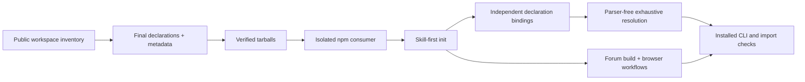

# Fluent Forum: packed-consumer acceptance

This nonpublished Nx project creates a functional React + Vite forum outside the
workspace, builds and packs the full selected public catalog graph, installs
local tarballs, and rejects workspace symlinks or nested registry copies.
Its baseline React, React DOM, declaration, and
TypeScript versions are derived exactly from the producer worktree's
`node_modules` so cached effective API views can be validated without artificial
dependency drift.

Set `FLUENTUI_PLAYGROUND_ROOT` to the caller-owned directory where the generated
app should live. There is deliberately no committed machine- or
session-specific default.

## Nx targets

### Init-to-Todo presentation

The separate [Todo demo runbook](demo/RUNBOOK.md) demonstrates live initialization followed by agent implementation.
It does not repurpose or overwrite the forum. Prepare a new directory outside the workspace (its parent must exist):

```sh
export FLUENTUI_DEMO_ROOT="$HOME/path/to/a-new-todo-demo"
yarn nx run cli-prototype:prepare-demo
yarn nx run cli-prototype:verify-demo
yarn nx run cli-prototype:start-demo
```

`prepare-demo` reuses the existing pack manifest and content-hashed tarballs without rebuilding Fluent UI. It creates
two standalone, installed projects: `starter` has only a placeholder and **no** config/skill/AGENTS guidance;
`reference` is a completed, initialized styled/headless Todo app. Open only the starter in the live agent's workspace.
The generated `RUNBOOK.md` contains concrete local paths, commands, the agent prompt, and rehearsal/fallback steps.

The same shared package-pinning code serves the forum and demo: direct tarballs plus npm transitive overrides,
producer React/compiler versions, exact declaration dependencies, and checks against symlinks or nested copies.
The demo omits the forum's npm alias fixture. `FLUENTUI_DEMO_PACK_MANIFEST` can select a previously saved manifest;
the selected manifest is copied into the demo, with its hash and starter-file hashes recorded in an ownership receipt.
Existing destinations are always rejected. Each project retains its own lockfile; local tarballs must remain available.

`verify-demo` checks the starter's write-free init dry-run, builds both apps, verifies real reference initialization,
deep metadata health and dense recommended imports without compiler loading, and runs the reference's browser tests.
It proves the starter remains byte-identical and uninitialized. Tests cover add/trim/validation, completion by keyboard,
filters and empty states, deletion/focus, live feedback, mobile layout, and forced colors. Evidence lives outside the
starter in `evidence/`; screenshots live in `reference/test-results/`. Verification starts/stops its own server.
Once the live starter has been changed, use its own app commands or prepare a new rehearsal instead of `verify-demo`.

`start-demo` serves the starter on `127.0.0.1:5180`; set `FLUENTUI_DEMO_APP=reference` to serve the reference on port 5181.
`FLUENTUI_DEMO_PORT` overrides the selected port; ports in use are rejected. No start target is run automatically.
`test-demo-harness` exercises pinning, producer baselines, installed identity, and safe destination refusal.

### Forum acceptance

Run from the `fluentui-cli-api-catalog` worktree:

```sh
export FLUENTUI_PLAYGROUND_ROOT="$HOME/path/to/fluentui-forum-playground"
yarn nx run cli-prototype:prepare
yarn nx run cli-prototype:rollout
yarn nx run cli-prototype:start
```

`prepare` is explicit and only creates an absent directory. It is never a
prerequisite of another target, so rebuilding or refreshing packages cannot
overwrite application source or configuration.

`rollout` builds the catalog graph, packs, clean-installs, initializes the
consumer, verifies exhaustive API coverage, builds the app, runs browser
interactions, and checks the installed CLI. Individual `inventory`,
`build-catalogs`, `pack`, `install`, `init`, `extensions`, `coverage`, `build`, and `test`
targets are available; targets other than `prepare` reuse the owned app.
Use `--excludeTaskDependencies` with `nx run-many` for a focused repeat after
its prerequisites have already succeeded.

After a generator-only change, `refresh-metadata` regenerates every selected
catalogue from its existing final declarations, without rebuilding component
JavaScript. Follow it with `pack` and `install` to refresh the consumer. Equivalent
ESM/CommonJS declaration routes share one API shard; coverage still checks every
public condition-specific binding.

The forum covers search, community navigation, feed sorting/filtering, voting,
saving, validated post creation, threaded replies, preferences, theme changes,
responsive drawers, loading/empty/error states, and toast feedback. The usage
manifest currently describes 32 distinct underlying families, including 11
headless families. `npm run verify`, also run by the test target, checks the
manifest against actual imports, rendered JSX, source files, and named browser
tests. Multiple Button variants or subcomponents do not inflate the count.
Playwright exercises these workflows, keyboard/focus behavior, responsive
layout, and browser errors.

`start` uses `127.0.0.1:5179` by
default; override it with `FLUENTUI_PLAYGROUND_PORT`. It reuses the existing
installation without rebuilding or recreating the app, preserving edits and
rollout evidence. Run `rollout` or `install` first if dependencies are missing.
Preparation and start check that the port is free. The test target starts and
stops its own Vite server through Playwright; acceptance does not leave a live
server running.

`rollout` runs the completed CLI against the clean packed consumer. It captures
JSON stdout, stderr, exit codes, and timings under
`artifacts/cli-rollout/` in the generated app. Assertions cover styled,
headless, and suite Button plus all four Accordion component routes, headless
props aliases, system selection, ambiguity, missing catalogs, complete
API publication, deep doctor, strict validation of every published
catalog, usage imports, and the versioned manifest. A preload probe fails
metadata-required API lookups if they initialize TypeScript, `ts-morph`, or the
metadata generator. Responses must resolve packages from the generated app's
local `node_modules`, contain source-backed declarations, and avoid fabricated
guidance.

API acceptance uses `--from` with real root/subpath import paths and infers component/type bindings without
`--namespace`. Root and subpath listings must stay separate. Normal help and the human manifest hide advanced
selectors, while the JSON manifest retains them. Malformed paths and conflicting selectors must fail with exit 2.
Styled/headless ambiguity must suggest only one additional system selector per choice, preserve workspace/config
and metadata policy, and both suggested commands must resolve successfully when replayed.

Human-output checks also exercise `api --system fluent-v9` and
`api Button --system fluent-v9`: public export listings and import paths must
not repeat condition variants, props must include literal values and optionality,
headless props must omit styled-only fields, and verbose diagnostics must be
deduplicated. JSON success alone does not satisfy these checks.

Detail must recommend the configured suite import for styled Button and the verified `./button` subpath for headless
Button. Props aliases use `import type`. Normal output hides declaration ownership and alternate routes; verbose
output and JSON retain them. JSON and Markdown must agree on the same recommendation, and explicit `--from` must
override catalog preferences. All emitted recommendation statements are type-checked against the installed consumer
with its TypeScript compiler and bundler-style module resolution, without changing application source. This compiler
check runs in the harness, not the CLI; metadata-required CLI processes must still pass the parser-free preload probe.
The consumer also installs the suite tarball under the real npm alias
`fluent-forum-styled` as an acceptance fixture: `api --from fluent-forum-styled`
must preserve the alias in its recommended value and type imports, and those imports
must compile. The forum application source does not import this alias; it is not
another design system or required for the UI. Its configured defaults remain the
canonical styled/headless facades. Doctor must identify the alias and distinguish
its auto-discovered catalogue from the explicitly configured canonical facade.

Default Button detail must show control-defined props before a compact inherited
React/DOM summary, within 100 lines and 12,000 characters. `--include-inherited`
must expand native props afterward, while `--verbose` keeps them collapsed.
Plain `--json` must retain all props and their declaration-package provenance, unchanged
by the human-output flag. These checks run against the installed tarballs.

Human reports use Markdown. Acceptance checks require real props tables with
escaped union types and declaration-authored defaults, Markdown doctor/manifest
and metadata-validation summaries, and matching stdout/file API output.

Slot acceptance requires Button's `icon` to show `Slot<'span'>` by default, including headless and direct props/slots
queries. `--expand-types` must restore its full intersection without expanding inherited members. JSON retains both
views and target provenance; neither verbose output nor inherited-member expansion disables compact slot types.

Dense JSON acceptance checks installed styled/headless components, direct props/slots/state types, hooks, external
facade exports, aliases, and condition-grouped listings. `--json --dense` must retain verified imports, descriptions,
defaults, required/readonly flags, statuses, and diagnostics without raw metadata. Native-member and full-type
expansion are independent; verbose adds only compact provenance. Dense Button must be at least 90% smaller than
full JSON, no larger than 8,000 bytes, and at most twice the Markdown size. The rollout summary records exact byte
counts. File/stdout parity, unchanged Markdown for `--dense` alone, error envelopes, and parser-free consumption
are also required.

`prepare` refuses every existing destination. `install` checks the private
package identity and ownership marker before replacing generated `node_modules`
or `package-lock.json`; application files are preserved. Unrelated directories
fail without modification. The generated consumer is
initialized as an uncommitted Git repository because the compatibility usage
report intentionally discovers tracked/untracked source through
`git ls-files`; no commit or push is created.

`prepare` records the exact producer versions in
`.fluentui-producer-baseline.json` and rewrites the generated app's direct
React, React DOM, `@types/react`, `@types/react-dom`, and TypeScript versions to
those exact values. The smoke test verifies the installed identities. Testing
intentional dependency drift belongs in a separate consumer; the baseline
rollout fails if matching producer dependencies still invalidate effective
views.

## Initialization and exhaustive coverage

`init` runs the installed CLI, not a workspace source entrypoint. It verifies a
write-free dry-run, packed skill assets and ownership hashes, a small managed
`AGENTS.md` pointer, byte-stable repetition, existing config/application
preservation, edited-skill and malformed-marker conflicts, and preservation of
unrelated agent instructions. Doctor setup health must remain independent of
catalog API coverage. Negative fixtures are restored before the target exits.
Removed bare/legacy metadata syntax must fail with `CLI_USAGE`, exit 2.
Evidence is written beneath `artifacts/cli-init/`.

`extensions` generates metadata for a synthetic private-package fixture, packs
and installs it in a separate consumer, and exercises custom-system API lookup,
explicit guidance approval, versioned upgrades, edit protection, and revocation.
The fixture does not require access to a private repository or registry.
Consumption must remain parser-free and must not execute package code.
The inspectable fixture and receipt are retained beneath
`artifacts/extension-acceptance/`. The CLI tarball also ships both the
configuration and extension-descriptor JSON Schemas.

`coverage` runs two separate processes. The first independently enumerates
installed public export-map declaration targets and TypeScript checker bindings.
The second compares every export/namespace/condition tuple against published
metadata and resolves it with the lean reader. A preload probe rejects compiler
or generator loading in that second process. An empty headless root remains
empty rather than acquiring synthetic root exports.

`artifacts/api-coverage/` contains the independently derived bindings, exhaustive
resolution matrix, per-package counts, record sizes, lookup timings, and
separately counted effective-type expansion limitations. The inventory is
fingerprinted against the pack manifest to reject stale evidence. Complete
public API routing does not claim that every arbitrary TypeScript type can be
fully expanded.
Separate generator processes profile regeneration from installed suite,
headless, and keyboard declarations, including generation/serialization time,
record sizes, and peak resident memory; they do not modify installed packages.



## Packed package contract

`packages.mjs` contains the CLI/metadata bootstrap roots and explicit scope
exclusions, not a pilot component allowlist. The harness discovers every
metadata-enabled Yarn workspace and independently rejects unclassified public
declaration-bearing libraries under `packages/react-components` without a
catalog. The current inventory includes 76 catalogs: styled/headless facades,
public component and compat leaves, deprecated components, runtime foundations,
JSX runtime, and tokens.

Exclusions are recorded in the package/pack manifests: Storybook and build/test
tooling, the two cross-stack v0/v8 migration adapters, and the Sass-only package
with an empty JavaScript declaration surface. This is the v9 component/runtime
surface, not a claim to cover the unrelated v0/v8 product stacks.

Before packing, the harness loads the repository's declared Yarn workspace
inventory and follows only runtime `dependencies` and `optionalDependencies`
from all publication roots. Every discovered workspace dependency is packed and
installed locally; its own manifest determines whether it publishes a catalog.
`build-catalogs` invokes Nx for the discovered roots with bounded concurrency
and their normal `^build` closure. Packing fails if any declared runtime artifact
was not built.

Catalogs fail `pack` unless their package manifests declare
`"fluentuiCatalog": "./metadata.json"` and publicly export `./metadata.json`.
The shipped export contract is the exact string
`"./metadata.json": "./dist/metadata/index.json"`, and each package's `files`
list must include `dist/metadata`. Every resolved target must remain inside the
package, exist in the packed tarball, and include its descriptor-relative API
record shards beneath `dist/metadata/api/`. Required runtime exports are checked
before packing so metadata cannot replace component entrypoints. Every selected
index must advertise complete API coverage, with no rollout omissions or
missing dependency catalogs. The exhaustive installed-reader gate verifies
those claims independently.

`install` removes `node_modules` and `package-lock.json`, writes absolute
`file:` tarball dependencies and npm overrides for the complete local runtime
closure, creates a new npm lock, and runs `npm ci`. Registry dependencies such
as React, Vite, icons, and non-workspace public transitives are installed
normally. Every local package identity is verified from the lock and extracted
package manifest; nested registry substitutions fail. Registry declaration
dependencies are pinned to the versions recorded in generated metadata so the
baseline does not introduce accidental dependency drift. Conflicting producer
versions fail explicitly instead of silently selecting one.
The pack manifest records per-package and aggregate compressed/unpacked and
metadata sizes, alongside the declaration-dependency baseline.
Tarballs use content-addressed filenames; a later forum run does not overwrite
archives referenced by an older consumer's lockfile.

## Final rollout

To refresh an existing app without recreating its source or configuration, build changed package artifacts first,
then skip the scaffold prerequisites:

```sh
yarn nx run cli:build
yarn nx run-many -p cli-prototype -t pack --excludeTaskDependencies
yarn nx run-many -p cli-prototype -t install --excludeTaskDependencies
yarn nx run-many -p cli-prototype -t rollout --excludeTaskDependencies
```

After package outputs are frozen, rerun `yarn nx run cli-prototype:rollout`.
Its prerequisite chain creates fresh tarballs and a clean install without
recreating source; do not reuse earlier tarballs as final evidence. The app's
`artifacts/cli-init/`, `artifacts/api-coverage/`, browser reports, and
`artifacts/cli-rollout/summary.json` contain the reproducible result.
The matching-producer baseline requires
cached effective views, including headless props aliases, to retain effective
members or signatures; blanket unsupported results fail the rollout.
