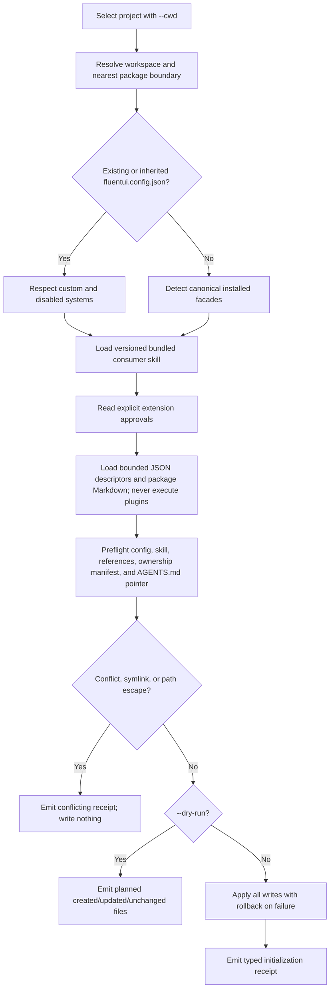
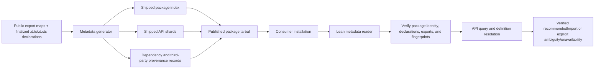
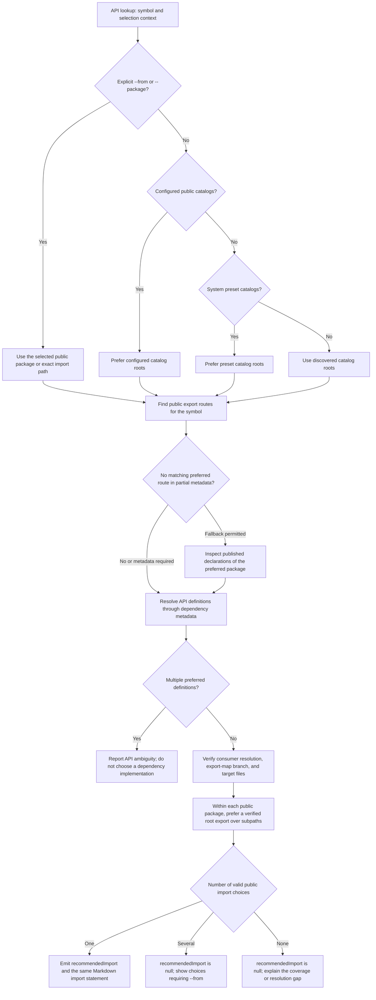

# @fluentui/cli

Command-line tool for Fluent UI usage reporting and installed-package API metadata.

> **Preview** — APIs and commands may change without notice.

## Usage

```sh
npx @fluentui/cli <command> [options]
```

> Run any command with `--help` for detailed options.

## Commands

### `init`

Set up deterministic, project-local Fluent UI guidance for coding agents:

```sh
npx @fluentui/cli init --dry-run
npx @fluentui/cli init
npx @fluentui/cli init --system fluent-v9 --system headless --json
npx @fluentui/cli init --cwd ./apps/forum
```

Init detects the canonical installed facades (`@fluentui/react-components` and
`@fluentui/react-headless-components-preview`) rather than promoting directly installed leaf packages to preferred
public imports. It respects existing or inherited `fluentui.config.json` systems, including custom and disabled
systems. It never installs dependencies, starts a server, edits application source, or makes network requests.

The complete write set is preflighted before mutation. Init rejects path escapes, symlinked targets, edited managed
skills, and malformed or duplicate `AGENTS.md` markers. Writes are applied as one rollback-protected transaction.
Repeat runs are byte-stable.



The generated files are:

- `fluentui.config.json` when no applicable config exists
- `.agents/skills/fluentui/SKILL.md` and focused references copied from the CLI package
- a project-local configuration schema and generated approved-extension index
- `.agents/skills/fluentui/.fluentui-cli.json` with asset version and content hashes
- a small owned pointer block in `AGENTS.md`, preserving all unrelated content

JSON output uses the `fluentui.init` envelope. `data.files` contains `created`, `updated`, `unchanged`, and
`conflicting` arrays; `dryRun` and `applied` distinguish planning from mutation.
`data.extensions` records the identities, installed versions, systems, and copied entry guides of approved extensions.

The `.fluentui-cli.json` file is an ownership receipt, not application state or catalogue configuration. Its version
and hashes protect edited files from being overwritten. Keep project-specific instructions outside the managed
skill directory. The agent following the skill prompts for CSS Modules or Tailwind when headless styling is needed,
and asks before registering private catalogues or approving package guidance. `init` itself remains non-interactive.

#### Configuration schema

The npm package ships:

```text
@fluentui/cli/schemas/fluentui.config.schema.json
@fluentui/cli/schemas/fluentui-extension.schema.json
```

New configurations receive a `$schema` reference to the managed project-local schema copy. This works even when
the CLI is invoked through `npx` or installed in a hoisted workspace; no machine-specific cache path is persisted.
Existing and inherited configs are not rewritten. To add editor support to an existing config after init, use:

```json
{
  "$schema": "./.agents/skills/fluentui/references/fluentui.config.schema.json",
  "schemaVersion": 1,
  "systems": {
    "acme": { "catalogs": [{ "package": "@acme/ui" }] }
  },
  "extensions": ["@acme/ui"],
  "preferences": { "headlessStyling": "css-modules" }
}
```

The preference is an example; the agent must ask the user before selecting `css-modules` or `tailwind`. System names
are open-ended. `extensions` is explicit consent to install package instructions, separate from selecting API data
in `systems`. Selecting a catalogue does not automatically approve its guidance.

#### Declarative package extensions

A catalogue package can advertise a data-only extension:

```json
{
  "fluentuiCatalog": "./metadata.json",
  "fluentuiExtension": "./fluentui-extension.json"
}
```

When an export map exists, it must expose the marker as a string JSON target, for example
`"./fluentui-extension.json": "./fluentui-extension.json"`. Include the descriptor and Markdown assets in the
published package's `files`. The descriptor contains:

```json
{
  "schemaVersion": 1,
  "system": "acme",
  "skill": "./guidance/SKILL.md",
  "references": ["./guidance/components.md"]
}
```

The package must be installed or workspace-linked and explicitly registered as a package catalogue in that enabled
system. Local-path catalogues remain supported for API data; installing their guidance requires an installed package
identity. `doctor --json` reports available marker-bearing packages and the project's approval list without opening
unapproved guides. After approval, run `init --dry-run`, review the receipt, then run `init`.

Guides are copied beneath `.agents/skills/fluentui/extensions/<package>/`, preserving relative paths.
`references/extensions.md` links package identities/versions to their entry guides. The generic skill follows
verified API imports first, then reads guidance scoped to the selected package; new systems do not require CLI
branches or modifications to the bundled base skill.

Only UTF-8 Markdown is copied: at most 16 packages, 32 files per package, 128 KiB per file, and 2 MiB total.
Descriptors are bounded to 64 KiB. Path escapes, symlinked assets, executable hooks, and remote assets are rejected.
Guidance is not executed or treated as permission to override project instructions. Init never clones repositories,
requests credentials, installs packages, or contacts a registry.

Unedited managed copies can be upgraded transactionally when their package changes. Removing approval removes only
unedited managed copies on the next init; edited files block the transaction rather than being deleted. Doctor
reports outdated/edited guidance through setup health, independently from API catalogue health.

### `report`

Generate reports for issue filing or codebase analysis.

```sh
# Quick environment/package summary for issue reporting
npx @fluentui/cli report info

# Deep codebase usage analysis of Fluent UI APIs
npx @fluentui/cli report usage --path ./src --reporter markdown --output report.md
```

### `metadata`

Generate canonical metadata from any built package root:

```sh
npx @fluentui/cli metadata generate \
  --package-root ./node_modules/@fluentui/react-components \
  --entrypoint . \
  --entrypoint ./unstable \
  --output ./artifacts/react-components-metadata
```

Strict validation reads every API record advertised by the selected index and validates all local references:

```sh
npx @fluentui/cli metadata validate ./artifacts/react-components-metadata --json
```

Passing an installed package directory additionally verifies the package identity, public `./metadata.json` export
containment, current declaration fingerprints, and every advertised API shard. Passing an individual index or record
outside its package performs bounded structural/reference validation only because no installed package identity or
declaration context is available. Advertised non-API record kinds fail explicitly until their validators ship.

Bare `metadata` prints subcommand usage. The removed `--entry`, `--reporter`, and bare-command extraction path are
not compatibility aliases; use `metadata generate` or `metadata validate`.

#### Publication and consumption flow

Metadata is generated from finalized published declarations and public export maps, then shipped with each package.
The installed CLI reader stays lean: it loads package indexes and API shards without loading TypeScript or
`ts-morph`. Dependency and bundled third-party records retain their original provenance rather than becoming
consumer-facing Fluent UI import paths.



### `api`

List public APIs available from the selected installed catalogs. Human listings show each export once per import
path, namespace, and installed version, grouping import/require condition variants:

```sh
npx @fluentui/cli api --cwd ./apps/my-react-app --system fluent-v9
```

Load an API by its public export name. Type/value bindings are inferred, and re-exports of the same definition are
merged. Use `--system` to choose a design system or `--from` with the actual npm import path:

```sh
npx @fluentui/cli api Button --system fluent-v9
npx @fluentui/cli api ButtonProps --system fluent-v9
npx @fluentui/cli api Button --from @fluentui/react-components
npx @fluentui/cli api Button --from @fluentui/react-headless-components-preview/button
npx @fluentui/cli api --from @fluentui/react-components/unstable
```

`--from @scope/package` selects only the root import; `--from @scope/package/subpath` selects exactly that public
subpath. Unscoped packages and installed npm aliases are supported. Omit the symbol to list that import's exports.
If distinct definitions still match, the error suggests the smallest additional selection needed, retaining the
workspace, config, metadata policy, and existing selection context. It does not guess between different APIs.

Advanced selectors remain available but are hidden from normal API help and the human manifest:
`--package` searches all subpaths of one package, `--entrypoint` restricts a public subpath, and `--namespace type|value`
resolves genuinely different type/value bindings. Do not combine `--from` with `--package` or `--entrypoint`.
The JSON manifest includes these advanced options with `hidden: true`. Type/value bindings are language concepts,
not semantic kinds such as component or hook.

#### Public import selection

API detail starts with one ready-to-use **Import** statement. Configuration selects the public package, not the
package owning its implementation or types. For example, the `fluent-v9` catalog recommends
`import { Button } from "@fluentui/react-components";`, while the headless catalog recommends
`import { Button } from "@fluentui/react-headless-components-preview/button";`.
The headless root exports nothing; its verified `./button` export determines the public import path.



`--from` wins over catalog preferences. Otherwise, explicitly configured catalogs take priority over presets,
and dependency catalogs remain definition/provenance sources rather than replacement public APIs. Missing a
configured facade export never silently redirects an agent to its implementation package.
Root preference applies **within each preferred package**; it does not select between two configured packages.
Several equally preferred subpaths require an explicit choice rather than alphabetical selection.

Recommendations use public export-map keys, including concrete wildcard matches and more-specific exclusions,
never physical `lib/` or `dist/` paths. Named exports (including exported namespace objects), default exports,
aliases, and type-only bindings produce the corresponding import syntax.

Recommendations currently target standard **ESM imports** and `import type`, using `types`, `import`, and `default`
conditions. Equivalent import/require metadata variants do not create duplicate choices. CommonJS-only branches,
custom environment conditions (such as `browser`, `node`, or `react-server`), unresolved local-only catalogs,
and missing runtime/declaration files produce explicit diagnostics instead of guessed imports. The CLI does not
infer the application's bundler, runtime conditions, or TypeScript module configuration.

JSON exposes `data.result.recommendedImport` with `moduleSpecifier`, `exportName`, `localName`, `kind`, `typeOnly`,
`statement`, and `reason`. `importStatus` is `selected`, `ambiguous`, or `unavailable`; `importCandidates` contains
the equally ranked verified choices. An unresolved recommendation is explicitly `null` and marks the result partial.
The declaration-owner `package`/`version` and complete `routes` remain in JSON. `--verbose` shows them as
**Defined in** and **All export routes**; normal output does not present them as competing import recommendations.
Index listings remain a lazy inventory of export routes, not per-symbol recommendations.

Component detail includes descriptions, the recommended public import, full call signatures, and expanded props with types,
literal unions, optional/required markers, documentation, and deprecations. Props come from the actual component
parameter type, not a guessed `<Name>Props` export: headless omissions and instantiated generic types are preserved.
Overloads retain separate props views. For union props, shared members and the variant count are shown explicitly.
Queries for props, state, slots, and other object types also enumerate their expanded members.

Human output is Markdown, including API index/import tables, fenced TypeScript signatures, and
`Prop | Type | Default | Description` tables. Required, readonly, deprecated, and incomplete members are marked
explicitly. Defaults come only from authored `@default`/`@defaultValue` tags in schema-v1 revision-3 catalogs;
`—` means no documented default, not necessarily no runtime default. Union pipes and embedded backticks are escaped
for Markdown tables. `--output api.md` writes the same Markdown as stdout; `--json` keeps the versioned data envelope.

Human output shows **control-defined members first**. Inherited React/DOM members are collapsed to a count;
`--include-inherited` expands them afterward, including full union variant expressions. Priority comes from original
declaration packages, not property names or `React.*` type references: control-defined callbacks and overrides such
as `disabled` remain prominent. Unknown provenance stays visible in an unclassified group. Provenance requires
regenerated schema-v1 revision-2 catalogs; older catalogs remain readable without guessing member ownership.

```sh
npx @fluentui/cli api Button --system fluent-v9
npx @fluentui/cli api Button --system fluent-v9 --include-inherited
npx @fluentui/cli api Button --system fluent-v9 --expand-types
npx @fluentui/cli api ButtonProps --from @fluentui/react-headless-components-preview/button
npx @fluentui/cli api Button --system fluent-v9 --verbose
```

`--verbose` adds definition ownership, alternative export routes, condition variants, record identity, and internal metadata diagnostics; it does not expand inherited
members. Normal output summarizes
partial catalog coverage and omits the internal semantic-reference-span limitation, which does not prevent displaying
types and props. Missing detail, dependency drift, truncation, and errors remain visible. Repeated diagnostics are
deduplicated without merging different package contexts.

Verified slot members use compact declaration-backed types such as `Slot<'span'>` by default. Alternate element
arguments, `NonNullable`, named custom props and specialization constraints are preserved rather than replaced by
a generic label. `--expand-types` restores the full effective member type; it is independent of `--include-inherited`
and `--verbose`. Unrecognized or transformed types stay expanded rather than being guessed from `as` or prop names.
A slot explanation is shown once per report. Plain `--json` retains both `type` and structured `presentation` metadata,
including verified slot identity and known intrinsic/component targets.

`--metadata-mode prefer` (the default) uses validated installed metadata and falls back lazily to the selected
package's declarations. `required` rejects roots without authoritative metadata. `off` bypasses metadata while
retaining the same config, system, package, and importer selection.

Use `--json` for the stable versioned response envelope:

```json
{
  "apiVersion": "1",
  "type": "fluentui.api-detail",
  "data": {},
  "diagnostics": [],
  "coverage": {},
  "status": "complete"
}
```

Plain `--json` always retains every member, declaration provenance, condition-specific routes, and all distinct diagnostics,
independently of `--include-inherited`. Component props are available under
`data.result.symbol.props`, with each entry linking a call signature to an expanded type view. This optional field
requires regenerated schema-v1 revision-1 catalogs and the matching reader; older catalogs explicitly report missing
component props rather than silently substituting a differently shaped type.

#### Dense JSON for agents

Use `--json --dense` for a structured equivalent of the compact Markdown view, rather than sending full metadata
into an agent's context:

```sh
npx @fluentui/cli api Button --system fluent-v9 --json --dense
npx @fluentui/cli api Button --system headless --json --dense --include-inherited
npx @fluentui/cli api ButtonSlots --from @fluentui/react-button --json --dense --expand-types
npx @fluentui/cli api --from @fluentui/react-components/unstable --json --dense
```

Dense responses keep `apiVersion: "1"` and use distinct types: `fluentui.api-detail.dense` and
`fluentui.api-index.dense`. The envelope still includes the original status, coverage, and deduplicated diagnostics,
including integrity failures and partial-data warnings. Plain `--json` is unchanged.

Detail is under `data.result`:

- `recommendedImport` and `importStatus` preserve the verified import selection. When no import can be recommended,
  `importCandidates` remains available; dense mode never guesses an import.
- `description`, `deprecated`, `type`, and `signatures` retain documentation and usable type/signature text.
- Component `props[].members`, or direct type `members.members`, show control-defined and unclassified members.
  Each member has `name`, `type`, `required`, `origin`, and available `description`, `default`, `readonly`,
  `deprecated`, and incomplete `status`. Omitted `readonly` means false; omitted `default` means undocumented.
- Member views expose `total`, `status`, `omittedInherited`, and any `omittedIssues`. `props: null` means unavailable
  props metadata; `props: []` means no props. `detailStatus` distinguishes available from unavailable symbol detail.
  Union variants retain their count and expand their expressions with inherited members.

`--include-inherited` expands native React/DOM members. `--expand-types` replaces marked `typeSummary: "slot"`
documentation summaries with full effective types, independently of inherited expansion. `--verbose` adds compact
definition ownership, export routes/conditions, record identity, and workspace context; it does not restore raw
metadata or expand members. Listings group condition variants while preserving distinct import paths, bindings,
versions, and metadata/declaration authority.

Raw declaration trees, source locations, reference spans, fingerprints, and resolved-package graphs are omitted.
No arbitrary character limit truncates descriptions or types. Use plain `--json` when those underlying records are
needed. `--output` writes the same dense document as stdout. Without `--json`, `--dense` leaves the already compact
Markdown output unchanged. The shipped consumer skill recommends dense JSON for agent lookups.

### `doctor`

Explain selected roots, installed-instance provenance, metadata/declaration authority, and API coverage. `--deep`
loads every advertised API record and verifies its fingerprint and structure. Doctor also reports configuration,
consumer-skill, and `AGENTS.md` pointer consistency in a separate **Project setup** section. Setup readiness does not
change or overstate catalog/API metadata coverage.

Human output is a Markdown table. “Selected via” describes catalogue selection, not package installation:
`configured` means an explicit config entry, and `auto-discovered` means another installed package with metadata.
Both configured and auto-discovered packages can ship self-discoverable metadata. Built-in presets, configured
local paths, and dependency roots explicitly selected with `--package` are identified separately.
Npm aliases display their installed name and canonical identity, for example
`fluent-forum-styled` (alias of `@fluentui/react-components@9.74.7`), so they cannot be mistaken for duplicate canonical
rows. JSON retains the existing `source`, `requestedPackage`, and `package` fields unchanged.
Without `--deep`, “API records” says “Not checked (N advertised)” rather than suggesting failed checks.
API coverage is declared by the catalog; health and record validation are separate columns. Records are metadata
files, not individual components or props. Equivalent ESM/CommonJS declaration routes share one record, so that
payload is counted once; deep validation still checks both branches' recorded inputs.
`manifest` and metadata `generate`/`validate` summaries also use Markdown.

```sh
npx @fluentui/cli doctor --cwd ./apps/my-react-app --system headless --deep --json
```

### `manifest`

Describe the command registry, flags, response types, and exit meanings without loading TypeScript or `ts-morph`:

```sh
npx @fluentui/cli manifest --json
```

## Preview status

- Declaration fallback reads installed published `.d.ts` files and does not modify the consumer package.
- The CLI does not fabricate guidance from declarations or consumer source.
- Yarn Plug'n'Play and arbitrary consumer path aliases are not supported by metadata v1; diagnostics identify
  unavailable resolution rather than reporting an empty successful catalog.

## Development

```sh
# Build
yarn nx run cli:build

# Test
yarn nx run cli:test
```
