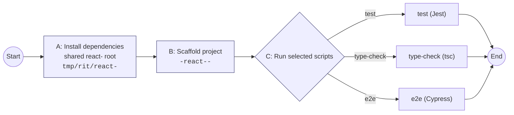

# react-integration-tester (rit)

CLI to scaffold and run integration checks for multiple React majors (17/18/19) using YOUR project's existing test tooling (Jest / Cypress / TypeScript). It re‑uses a single shared dependency install per React major and creates cheap throw‑away (or reusable) scaffold projects exposing exactly three scripts: `test`, `type-check`, `e2e`.

## Essentials

React majors support: 17, 18, 19
Runners support: `test` (Jest), `type-check` (TypeScript), `e2e` (Cypress)
Shared root: `<repoRoot>/tmp/rit/react-<major>/` (deps installed once)
Prepared project naming:

```
<repoRoot>/tmp/rit/react-<major>/<origin-project-name>-react-<major>-<project-id>
```

When you omit `--project-id`, a random suffix is used instead of `<project-id>`, e.g.

```
button-react-18-7423891
```

This deterministic pattern (when you pass `--project-id`) lets you reliably re‑use a scaffold across multiple `--run` invocations without re‑preparing.

## How it works



Legend:

- A runs when you use `--install-deps`, or implicitly during a prepare/run unless you pass `--no-install` with prior deps installed.
- B runs on `--prepare-only` or any one‑shot run without `--project-id` (temporary) or with `--project-id` (reusable).
- C executes only the scripts you explicitly list via repeated `--run` flags, sequentially.

## Quick start

```bash
# Prepare once (install deps -> generate scaffold)
rit --react 18 --prepare-only --project-id demo

# Run scripts (re-uses scaffold + node_modules -> run)
rit --react 18 --project-id demo --run test --run type-check
```

One‑shot run (install -> prepare -> run -> cleanup):

```bash
rit --react 19  --run test
```

Install deps only (CI cache warm):

```bash
rit --react 17 --install-deps
```

## Usage

```bash
rit --react <17|18|19> \
  [--project-id <id>] [--config <file>] [--cwd <path>] \
  [--prepare-only [--no-install] [--force]] \
  [--install-deps] \
  [--run <test|type-check|e2e> ...] \
  [--cleanup|--no-cleanup] [--verbose]
```

Flag reference (implementation accurate):

- `--react` (required for every invocation) React major.
- `--project-id` stable suffix enabling scaffold reuse. Required when using `--prepare-only`. Optional otherwise (random suffix used if omitted).
- `--config` path to a config module (CommonJS or ESM). Defaults to `./rit.config.js` if present.
- `--prepare-only` create/update a scaffold (and install unless `--no-install`). Does NOT run scripts.
- `--no-install` (only valid with `--prepare-only`) skips dependency installation. Requires that dependencies have already been installed earlier via `--install-deps` for that React major; otherwise it fails fast.
- `--install-deps` install/update shared deps for the React major root and exit (no scaffold created).
- `--run <script>` select one or more scripts to execute sequentially. Repeat the flag for multiple (e.g. `--run test --run type-check`). You must list all you want; there is no implicit “run all”.
- `--force` (with `--prepare-only`) delete existing scaffold with the same computed name before recreating it.
- `--cleanup` / `--no-cleanup` (default: cleanup) remove the temporary project after running. When reusing via `--run` + `--project-id`, cleanup is effectively a no‑op; the scaffold remains unless you prepared and then ran in one shot without reuse.
- `--verbose` extra logging including resolved metadata.
- `--cwd` working directory for discovering the origin project (defaults to process cwd).

Rules & guardrails:

- `--run` cannot be combined with `--prepare-only` or `--no-install`.
- `--prepare-only` requires `--project-id` (deterministic reuse is a core feature).
- You must pass at least one `--run` OR use `--prepare-only` OR `--install-deps`.
- Reusing (`--run ... --project-id <id>`) requires that dependencies are already installed for that React root (`rit --install-deps --react <major>` or a prior prepare/run that installed them).

## Configuration (`rit.config.js`)

If you need to tweak defaults you have 2 options:

- create `rit.config.js` within your project root
- create any js module that follows the RIT Config API and point `rit` to it via `--config '<path_to_module>'`

You can override per‑major React version runner settings (command + optional config file path) and add/override dependencies. Merge is shallow: builtin template + your overrides.

### New (current) Config API

`runConfig` fully replaces the old `commands` field (which has been removed).

```ts
export interface ReactOverrides {
  runConfig?: {
    test?: { command?: string; configPath?: string }; // script name => "test"
    'type-check'?: { command?: string; configPath?: string }; // script name => "type-check"
    e2e?: { command?: string; configPath?: string }; // script name => "e2e"
  };
  dependencies?: Record<string, string>; // merged into shared react-<major> root
}

export interface Config {
  react: {
    17?: ReactOverrides;
    18?: ReactOverrides;
    19?: ReactOverrides;
  };
}
```

### What `runConfig` lets you change

- `command`: the exact script body that will be written into the scaffold project's `package.json` under the mapped script name.
- `configPath`: the relative path (from the origin project root) to the tooling config file you want the scaffold to reference (e.g. a custom `jest.base.js`, `cypress.custom.config.js`, or `tsconfig.tests.json`).

If you omit a property, the builtin default is used (both for the command and the config file name). You can override only one of them.

### Builtin defaults (per runner)

| Runner     | Default command (simplified)                     | Default config file written into scaffold |
| ---------- | ------------------------------------------------ | ----------------------------------------- |
| test       | `jest --runInBand`                               | `jest.config.js`                          |
| type-check | `tsc -p tsconfig.lib.json --pretty`              | `tsconfig.lib.json`                       |
| e2e        | `cypress run` (exact args may vary per template) | `cypress.config.ts` (falls back to `.js`) |

### Config file resolution & fallback

When deciding whether to expose a script in the prepared project, RIT checks for the existence of the associated config file in the origin project:

1. If your override provides `configPath`, that exact file must exist (otherwise the script is skipped).
2. If no override is provided for `e2e` or `test`, RIT first looks for the TypeScript form (`cypress.config.ts`, `jest.config.ts`) only where applicable; for Jest we default to `jest.config.js`. For Cypress we attempt `cypress.config.ts` and, if missing, fall back to `cypress.config.js` automatically.
3. For TypeScript (`type-check`), the presence of the referenced tsconfig (default `tsconfig.lib.json` unless you override) controls whether the `type-check` script is added.

This means you can run in projects that still use `.js` Cypress config files without adding an override.

### Minimal config example (override command only)

```js
/** @type {import('@fluentui/react-integration-tester').Config} */
module.exports = {
  react: {
    17: {
      runConfig: {
        test: {
          // Change the jest invocation for React 17 runs
          command: 'jest --passWithNoTests -u --testPathIgnorePatterns test-file-that-wont-work-in-react-17.test.tsx',
        },
      },
      // Extra deps installed once under ./tmp/rit/react-17/node_modules
      dependencies: { 'some-package': '^1.2.3' },
    },
  },
};
```

### Example overriding config paths

```js
module.exports = {
  react: {
    19: {
      runConfig: {
        test: { configPath: 'config/jest.react19.js' },
        'type-check': { command: 'tsc -p tsconfig.react19.json --pretty', configPath: 'tsconfig.react19.json' },
        e2e: { configPath: 'cypress.react19.config.ts' },
      },
    },
  },
};
```

The runner key must be written verbatim as `type-check` (no camelCase alias). Use `--run type-check` when executing.

Only these three script names are runnable (`--run test|type-check|e2e`). Any other scripts produced by your local template are ignored by the CLI selector.

### Migration from the removed `commands` field

Old (removed):

```js
// BEFORE
module.exports = {
  react: { 18: { commands: { test: 'jest', 'type-check': 'tsc -p tsconfig.json', e2e: 'cypress run' } } },
};
```

New:

```js
// AFTER
module.exports = {
  react: {
    18: {
      runConfig: {
        test: { command: 'jest' },
        'type-check': { command: 'tsc -p tsconfig.json' },
        e2e: { command: 'cypress run' },
      },
    },
  },
};
```

To also override config file names, add `configPath` inside each runner block.

## Typical CI flow

Install dependencies for your React major under test (cache warm; safe to run repeatedly—it only rewrites/reacts when deps change):

```bash
rit --react 18 --install-deps
```

From project root:

```bash
# prepare project with known suffix so we can target it against --run (depends already installed)
rit --react 18 --prepare-only --no-install --project-id ci

# execute following in parallel via your task runner for best performance
rit --react 18 --project-id ci --run test
rit --react 18 --project-id ci --run type-check
```

## Multiple runners

```bash
rit --react 19 --project-id all --run test --run type-check --run e2e  # runs sequentially
# Partial subset
rit --react 19 --project-id fast --run type-check
```

## Project naming & reuse

Given a source package `@scope/button` and `--react 18 --project-id demo` the scaffold will live at:

```text
<repoRoot>/tmp/rit/react-18/button-react-18-demo
```

Reusing later:

```bash
rit --react 18 --project-id demo --run test
```

If you omit `--project-id` the name ends with a random number and is NOT intended for reuse.

## Troubleshooting

- Reset cache (all scaffolds + deps for a major): delete `<repoRoot>/tmp/rit/react-<major>/`.
- Template or dependency change: run `rit --react <major> --install-deps` (updates root package.json & installs if needed).
- Missing script: confirm it exists in merged template AND origin project tooling (e.g. Jest/Cypress present). You must invoke with kebab-case (`type-check`).
- Using `--prepare-only --no-install` without prior `--install-deps` will fail intentionally to prevent unusable scaffolds.
- Keep a scaffold for iterative local debugging: run with `--no-cleanup` (except when reusing via `--project-id`, cleanup is already a no-op).
- Force a clean re‑prepare (discard old scaffold): add `--force`.

## Contributing

Inside this repo only:

- Build: `nx run react-integration-tester:build`
- Tests: `nx test react-integration-tester:test`
