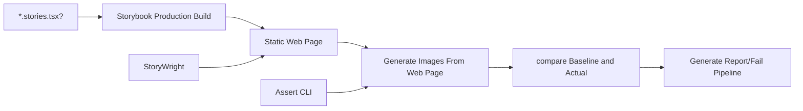

# visual-regression-assert

This library was generated with [Nx](https://nx.dev).

## About

CLI tool for CI and Local environment for Visual Regression Diffing.

### How it works

### Usage

**run assertion**

Runs assertions against actual Stories Visual Regression Scenarios and generates report in various formats (html,markdown) for CI and User Diff examination.

If any diff is present it will fail the process - this is crucial for CI environment to fail the VRT pipeline.

`visual-regression-assert assert --baselineDir src/__snapshots__ --outputPath dist/vrt`

**prepare diff report for CI**

If this tool is used in monorepo context it will go through all projects that contain assert command and it will aggregate all project reports to 1 folder with grouped by project report.

Output of this command is crucial for CI.

`visual-regression-assert report --outputPath dist/vrt`

## Building

Run `nx build visual-regression-assert` to build the library.

## Running unit tests

Run `nx test visual-regression-assert` to execute the unit tests via [Jest](https://jestjs.io).
