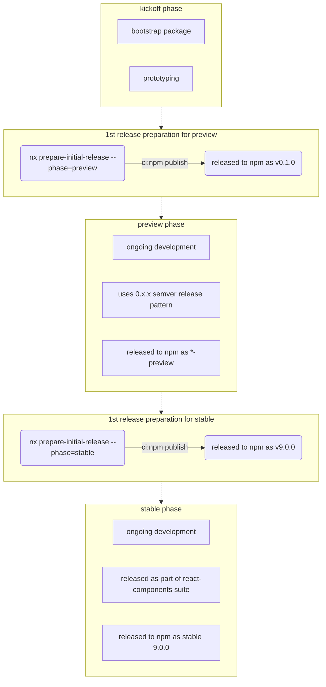

# prepare-initial-release

Workspace Generator which automates initial release process steps for `preview` and `stable` stages of core @fluentui (v9) packages.

### V9 Release process flow:



<!-- toc -->

- [Usage](#usage)
  - [Examples](#examples)
- [Options](#options)
  - [`project`](#project)
  - [`phase`](#phase)

<!-- tocstop -->

## Usage

```sh
yarn nx g @fluentui/workspace-plugin:prepare-initial-release ...
```

Show what will be generated without writing to disk:

```sh
yarn nx g @fluentui/workspace-plugin:prepare-initial-release --dry-run
```

### Examples

```sh
yarn nx g @fluentui/workspace-plugin:prepare-initial-release
```

## Options

#### `project`

Type: `string`

Library name to to be released.

#### `phase`

Type: `preview` | 'stable'

Phase of npm release life cycle for monorepo package
