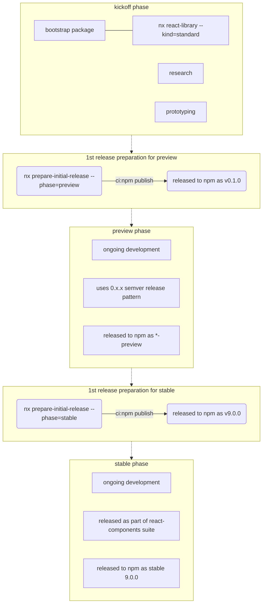
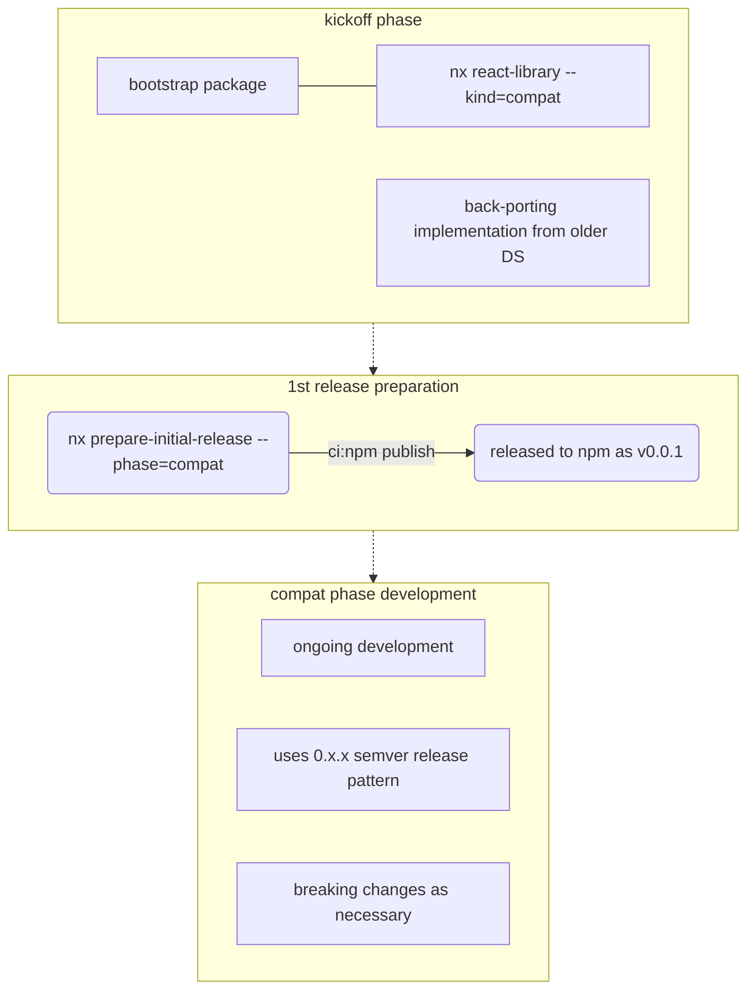

# prepare-initial-release

Workspace Generator which automates initial release process steps for `preview` and `stable` stages of core @fluentui (v9) packages.

## v9 Release process flow:

We have 2 kinds of packages in v9:

- standard
- compat

### Standard

Core control/library following all converged patterns (Research,Figma, Specs)

- this ships initially with `-preview` suffix as standalone package
- when entering stable phase, `-preview` suffix is removed and package becomes part of `react-components` suite



### Compat

Control/library ported directly from v8 or v0 to use v9 apis including griffel.

> [Learn more](https://github.com/microsoft/fluentui/blob/master/packages/react-components/react-datepicker-compat/README.md#compat-component)

- this always ships with `-compat` suffix as standalone package ( never becomes part of `react-components` suite )



<!-- toc -->

- [Usage](#usage)
  - [Examples](#examples)
- [Options](#options)
  - [`project`](#project)
  - [`phase`](#phase)

<!-- tocstop -->

## Usage

```sh
yarn nx g @fluentui/workspace-plugin:prepare-initial-release ...
```

Show what will be generated without writing to disk:

```sh
yarn nx g @fluentui/workspace-plugin:prepare-initial-release --dry-run
```

### Examples

```sh
yarn nx g @fluentui/workspace-plugin:prepare-initial-release
```

## Options

#### `project`

Type: `string`

Library name to to be released.

#### `phase`

Type: `preview` | 'stable' | 'compat'

Phase of npm release life cycle for monorepo package
